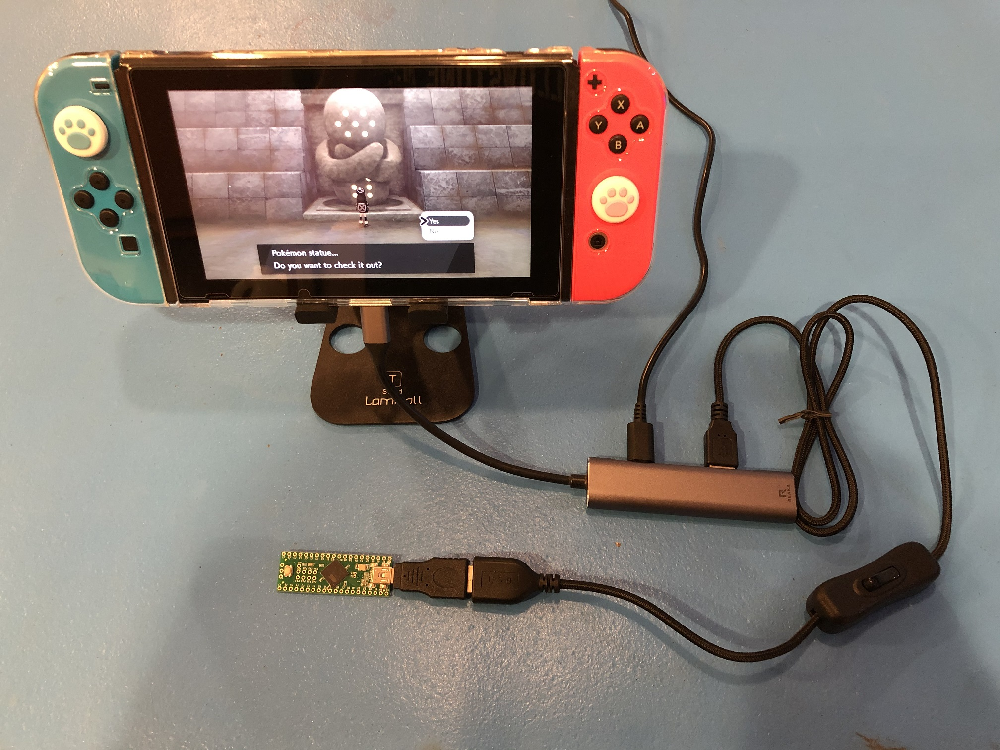
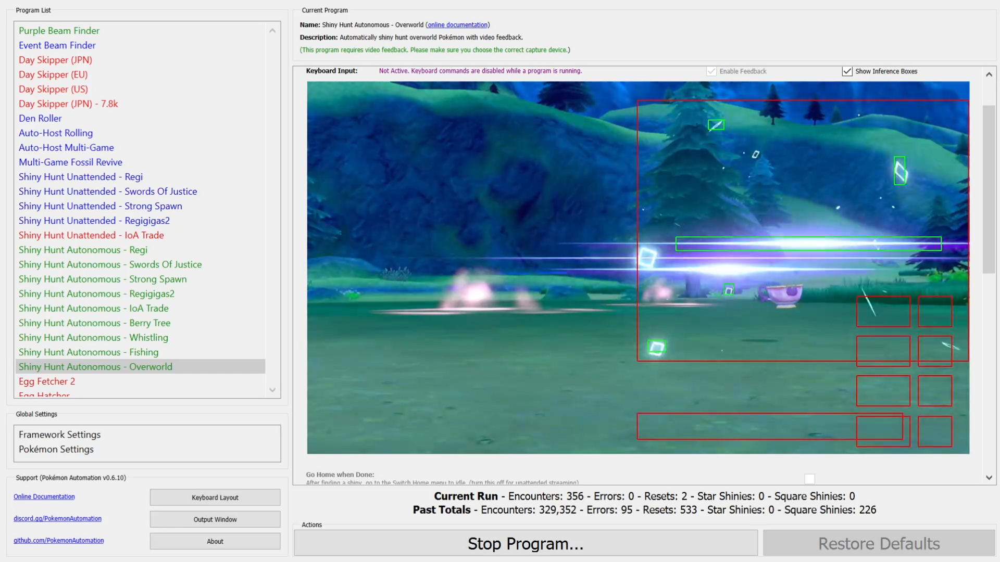

#  Pokémon Automation (Landing Page)

Welcome to Pokémon Automation's official GitHub group.

## What is this?

Pokémon Automation is a project that strives to automate the Pokémon games.

### Why automate the game?

Certain aspects of Pokémon are very boring and tedious (such as shiny hunting). So rather than spending hundreds of hours grinding with manual gameplay, you have a bot do it for you. Thus the fun changes to managing the bots that play the game for you.

With automation, it becomes possible to play 24/7 and simultaneously on multiple devices without wasting too much of your own time. Thus with so much extra game time, it becomes possible to legitimately obtain extremely rare Pokémon that are normally only feasible via hacking.

### How does this work?

The Nintendo Switch allows the use of 3rd party wired controllers. But instead of using an actual game controller, we emulate a controller using a microcontroller such as an Arduino. This microcontroller can then be programmed to send button presses to the Switch. Once programmed, all that is needed is to plug the microcontroller into your Switch's USB port just like any handheld controller and watch it do its thing.

This approach is not new. Other projects such as brianuuuSonic's AutoController[(1)](README.md#1-brianuuusonics-autocontroller) use the same approach.

Our version of these "microcontroller-only" programs can be found in the Microcontroller Repo[(2)](README.md#2-microcontroller-repo).

 

### What do we do differently?

While most automation is entirely Arduino or microcontroller based, we take it to a new level. We connect the microcontroller to a PC to utilize the full computing potential of a modern computer. This allows us to perform visual recognition of the display and make gameplay decisions the same way a human player would.

This has allowed us to automate every single shiny hunt in Pokémon Sword/Shield. And we look forward to Pokémon Brilliant Diamond and Shining Pearl!

These "computer-controlled" programs can be found in our Computer-Control Repo[(3)](README.md#3-computer-control-repo).

**Examples:**

Automatic detection of shiny encounters using visual recognition of the shiny sparkle animation.

Automatic playthrough of Dynamax Adventures to shiny-hunt legendaries.

## Get Me Started!

Interested? This is **STEP 1**

Choose the link below that aligns with your experience with electronics.

| [Beginner](dead) | [Experienced](dead) |
| --- | --- |
| I have *not* used a microcontroller before | I have used a microcontroller before |
| Make it work, simply | Options are okay |
| I'm new to GitHub | I've used GitHub a few times |

## Credits

A lot of credit goes to brianuuuSonic who first brought Arduino-based automation to Pokémon Sword/Shield. Without his work to spur our interest in this area, we wouldn't have formed this group to begin with.

**Major Contributors:**

- Mysticial - Project founder.
- MrDonders - R&D and pioneer of serial hardware.
- pifopi - Development + R&D
- Koi - Discord bot integration.
- denvoros - Build scripts, Mac support, and AI R&D.
- Ryder - Documentation and wiki management.
- baboul - Development
- SakuraKim - Development + R&D.
- joyrida - Build scripts and Mac support.

And countless users and testers in the Pokémon Automation Discord Server.

## Supporting Us

As of this writing, we do not take donations of any kind for this project. The only support we request is by sharing our work with your friends if you have enjoyed using it.
In the spirit of transparency, we kindly ask that you disclose the use of automation when sharing photos or videos of Pokémon obtained using these programs.
This can be done simply by sharing a screenshot of the program with stats or with a text footer indicating it is done by automation.

If such a disclosure is not permissible, we ask that you avoid any explicit or implicit claims that such Pokémon were caught manually.

## License

You are free to use our software personal use only.

Do not try to profit off of these programs. It's just a game; keep the money out of it and have fun.

For all other uses, please reach out to the administrators of the Pokémon Automation discord server.

This software is provided "as is" and the developers disclaim all warranties with regard to this software including all implied warranties of merchantability and fitness. In no event shall the developers be liable for any special, direct, indirect, or consequential damages, or any damages whatsoever resulting from loss of use, data or profits, whether in an action of contract, negligence or other tortious action, arising out of or in connection with the use or performance of this software.

# References
### (1) [brianuuuSonic's AutoController](https://github.com/brianuuu/AutoController_swsh)
### (2) [Microcontroller Repo](https://github.com/PokemonAutomation/Microcontroller)
### (3) [Computer-Control Repo](https://github.com/PokemonAutomation/ComputerControl) 

