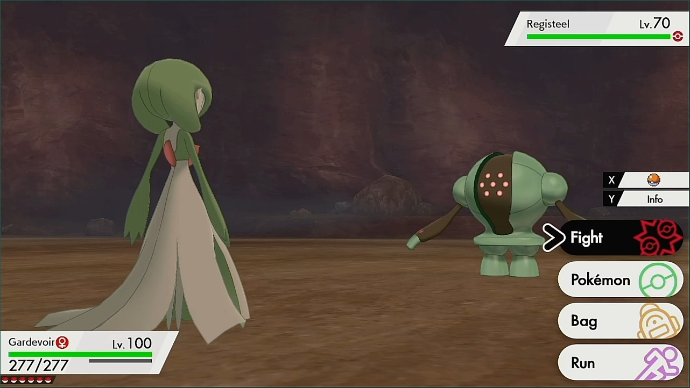
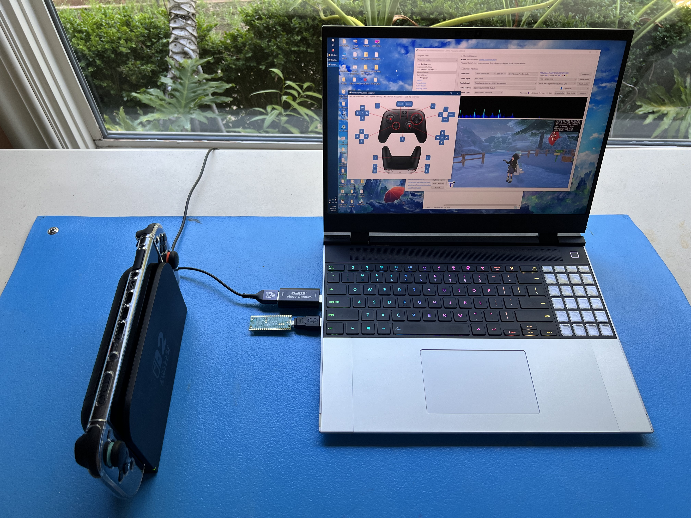
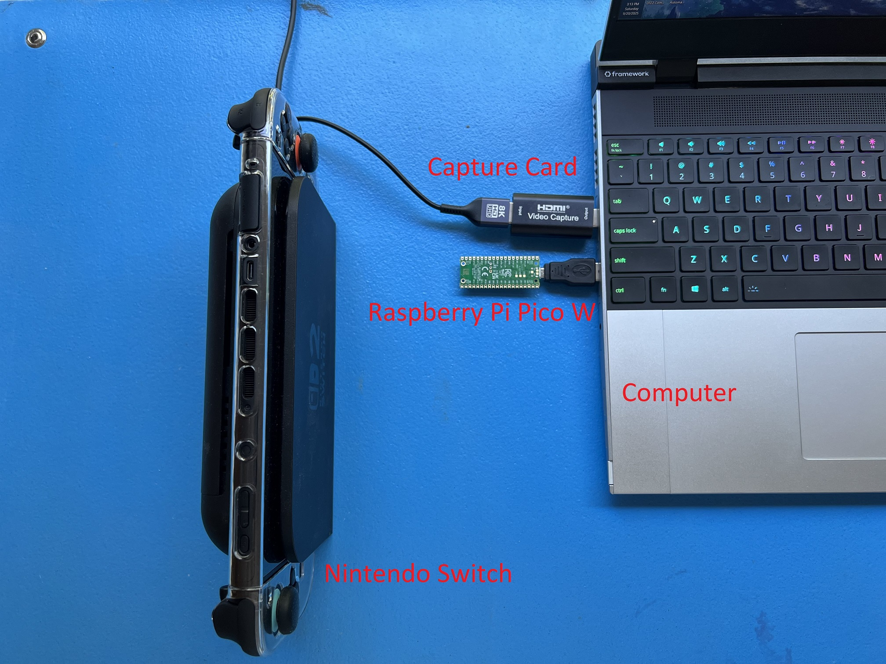
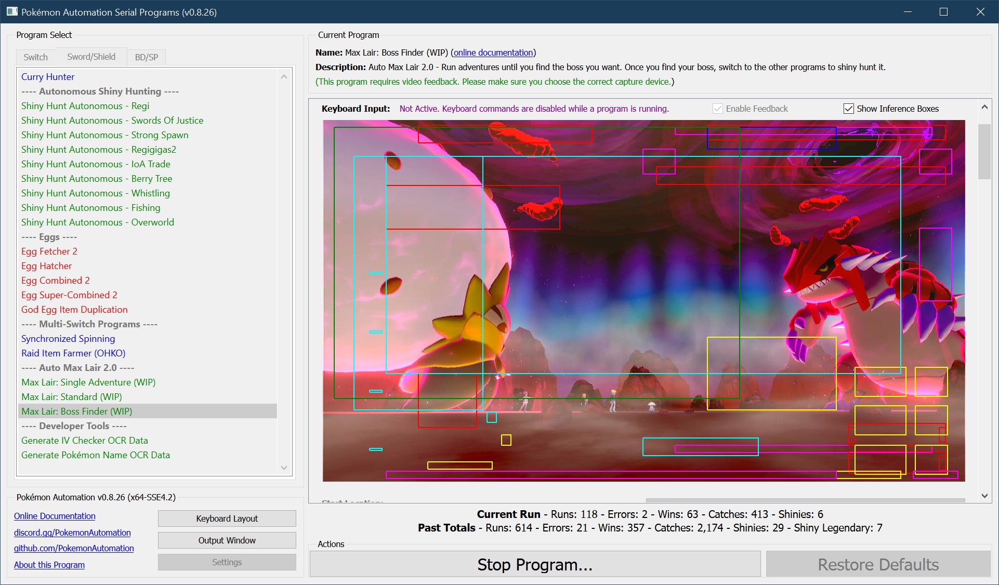
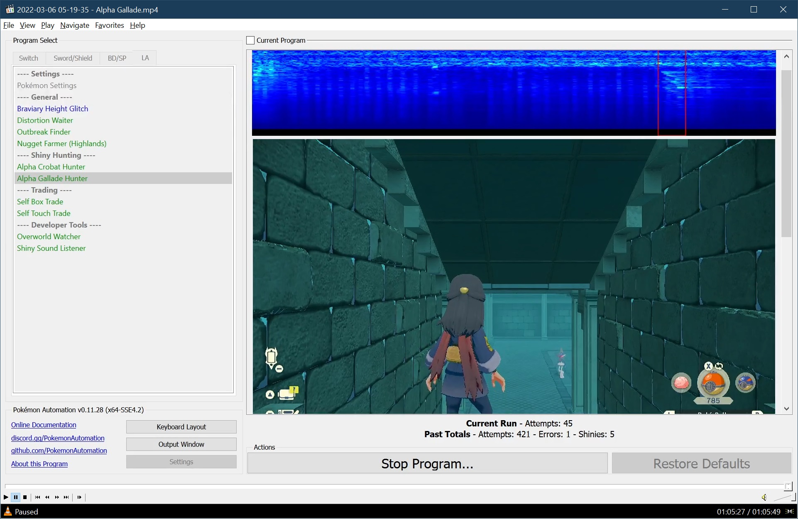

#  Pokémon Automation (Landing Page)

Welcome to Pokémon Automation's official GitHub group.

## What is this?

Pokémon Automation is a project that strives to automate the Pokémon games.

### Why automate the game?

Certain aspects of Pokémon are very boring and tedious (such as shiny hunting). So rather than spending hundreds of hours grinding with manual gameplay, you have a bot do it for you. Thus the fun changes to managing the bots that play the game for you.

With automation, it becomes possible to play 24/7 and simultaneously on multiple devices without wasting too much of your own time. Thus with so much extra game time, it becomes possible to legitimately obtain extremely rare Pokémon that are normally only feasible via hacking.

### How does this work?

A computer with video capture and a custom game controller!

By capturing the video and audio using a capture card, a computer can see (and hear) everything that's happening on the Switch.

To control the Switch, we create our own 3rd party gamepad using a programmable microcontroller:
- Using a Raspberry Pi Pico W or an ESP32 microcontroller, we can make a joycon using the Bluetooth gamepad protocol.
- Using an ESP32-S3, we can make a wired pro controller using the USB gamepad protocol.

These custom controllers behave just like regular controllers. But rather than having buttons and joysticks that are pressed by a human, they are controlled electronically by a computer.

Since the computer can both see and control the Switch, it can take the place of a human player. But unlike a human, a computer doesn't eat or sleep. And it never gets tired or bored. So you can run it 24/7 for months on end hunting shinies for you!

 

### Examples:

Automatic detection of shiny encounters using visual recognition of the shiny sparkle animation.

Automatic playthrough of Dynamax Adventures to shiny-hunt legendaries.

Shiny detection in Pokémon Legends Arceus using audio recognition.

## What games do you automate?

See our [full program list](https://github.com/PokemonAutomation/ComputerControl/blob/master/Wiki/Programs/README.md)!

We currently have automation for the following games/platforms:
  - [Nintendo Switch](https://github.com/PokemonAutomation/ComputerControl/blob/master/Wiki/Programs/README.md#nintendo-switch)
  - [Pokémon Home](https://github.com/PokemonAutomation/ComputerControl/blob/master/Wiki/Programs/README.md#pok%C3%A9mon-home)
  - [Pokémon Let's Go Pikachu/Eevee](https://github.com/PokemonAutomation/ComputerControl/blob/master/Wiki/Programs/README.md#pok%C3%A9mon-lets-go-pikachueevee-lgpe)
  - [Pokémon Sword/Shield](https://github.com/PokemonAutomation/ComputerControl/blob/master/Wiki/Programs/README.md#pok%C3%A9mon-swordshield)
  - [Pokémon Brilliant Diamond/Shining Pearl](https://github.com/PokemonAutomation/ComputerControl/blob/master/Wiki/Programs/README.md#pok%C3%A9mon-brilliant-diamondshining-pearl)
  - [Pokémon Legends Arceus](https://github.com/PokemonAutomation/ComputerControl/blob/master/Wiki/Programs/README.md#pok%C3%A9mon-legends-arceus)
  - [Pokémon Scarlet/Violet](https://github.com/PokemonAutomation/ComputerControl/blob/master/Wiki/Programs/README.md#pok%C3%A9mon-scarlet-and-violet)
  - [Zelda: Tears of the Kingdom](https://github.com/PokemonAutomation/ComputerControl/blob/master/Wiki/Programs/README.md#zelda-tears-of-the-kingdom)

## Get Me Started!

- [Computer Control Setup Gude](https://github.com/PokemonAutomation/ComputerControl/blob/master/Wiki/SetupGuide/README.md)

**Video Tutorials:**
- **Wired (ESP32-S3):** https://youtu.be/ezBuwk48z8w (recommended for newcomers)
- **Wireless (ESP32):** https://youtu.be/YzGyQQOGjl8
- **Legacy Wired (Arduino):** https://youtu.be/DFXZzWkOEMs (deprecated, difficult to setup)

## But what about your old setup?

If you are asking about our Microcontroller (MC) automation. It has officially been deprecated now.

MC automation has neither been developed nor maintained in years. So it's time to close to the door on it.

Nevertheless, the Microcontroller wiki can be found here:
- [Microcontroller Repo](https://github.com/PokemonAutomation/Microcontroller)
- [Microcontroller Setup Gude](https://github.com/PokemonAutomation/Microcontroller/blob/master/Wiki/SetupGuide/README.md)

## Credits

**Contributors:**

- [Kuroneko (mysticial)](https://github.com/Mysticial) - Project founder.
- [Gin (gin2531)](https://github.com/Gin890) - R&D, Program+Framework development, Qt6, audio, and Mac support.
- [pifopi (pifopi)](https://github.com/pifopi) - R&D, AutoMaxlair, Program+Framework Development.
- [MrDonders (conkelders)](https://github.com/ercdndrs) - R&D, AutoMaxlair, pioneer of serial hardware.
- [denvoros (denvoros)](https://github.com/denvoros) - AI R&D, AutoMaxlair, Build scripts, Mac support.
- [jw (jw2219)](https://github.com/jw098) - R&D, controllers, Program Development.
- [kichithewolf (kichithewolf)](https://github.com/kichithewolf) - R&D, Program Development.
- [SakuraKim (sakurakim9422)](https://github.com/SakuraKimAce) - R&D, Program+Framework Development.
- [Koi (koiffeinated)](https://github.com/Koi-3088) - Discord bot integration.
- [Fye (fyelice)](https://github.com/fyex) - Program Development
- [Nymphea (aozawa)](https://github.com/NympheaR) - Program Contributor
- [Icaroto (icaroto)](https://github.com/PhobosLegacy) - Program Contributor
- [Ryder (_ryder)](https://github.com/Ensamma) - Documentation and wiki management.
- [baboul (baboul29)](https://github.com/mb-baboul) - Program Contributor
- [joyrida (joyrida)](https://github.com/RickyGrassmuck) - Build scripts and Mac support.
- Ptamalion (ptamalion) - Program Contributor and Qt6 support.
- b0bness (b0bness#9479) - Program Contributor

And countless users and testers in the Pokémon Automation Discord Server.

## Supporting Us

As of this writing, we do not take donations of any kind for this project. The only support we request is by sharing our work with your friends if you have enjoyed using it.
In the spirit of transparency, we kindly ask that you disclose the use of automation when sharing photos or videos of Pokémon obtained using these programs.
This can be done simply by sharing a screenshot of the program with stats or with a text footer indicating it is done by automation.

If such a disclosure is not permissible, we ask that you avoid any explicit or implicit claims that such Pokémon were caught manually.

## License

You are free to use our software for personal use only.

Do not try to profit from these programs. It's just a game; keep the money out of it and have fun.

For all other uses, please reach out to the administrators of the Pokémon Automation discord server.

This software is provided "as is" and the developers disclaim all warranties with regard to this software including all implied warranties of merchantability and fitness. In no event shall the developers be liable for any special, direct, indirect, or consequential damages, or any damages whatsoever resulting from loss of use, data or profits, whether in an action of contract, negligence or other tortious action, arising out of or in connection with the use or performance of this software.

