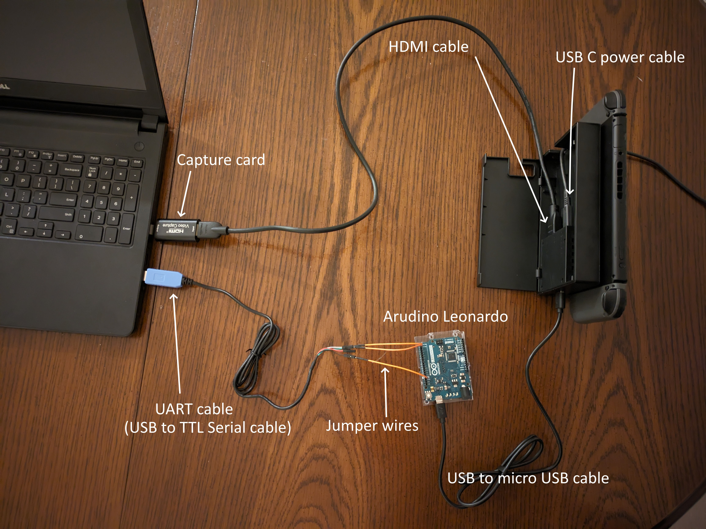
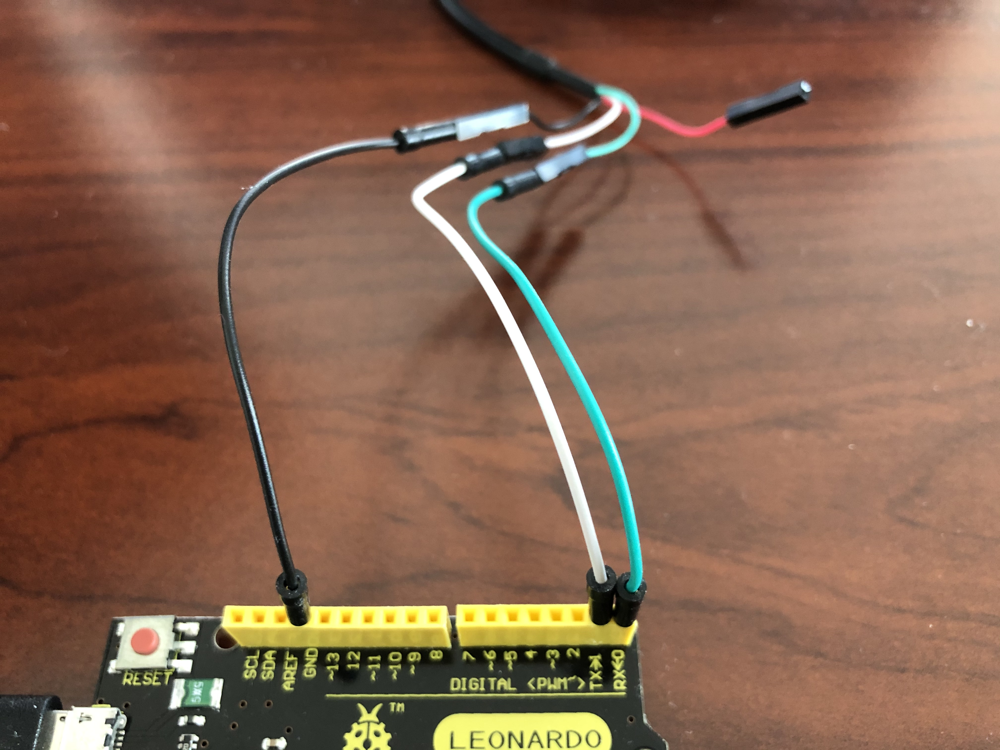
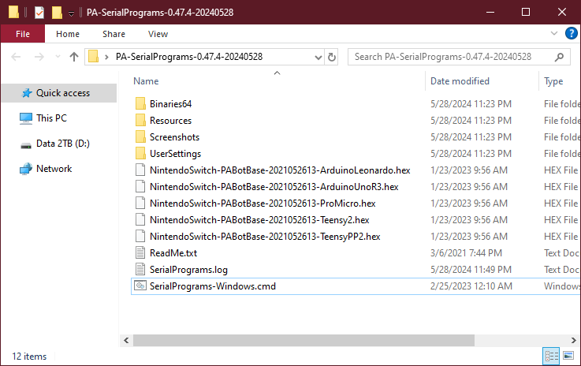
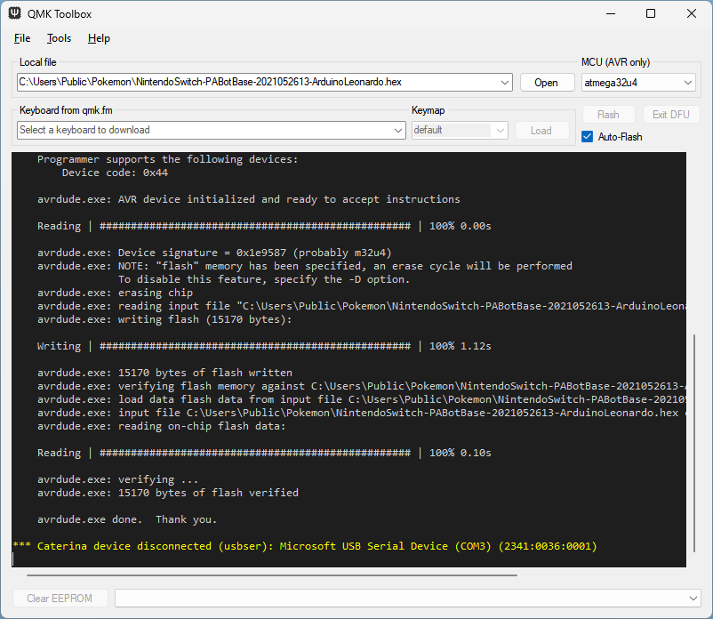
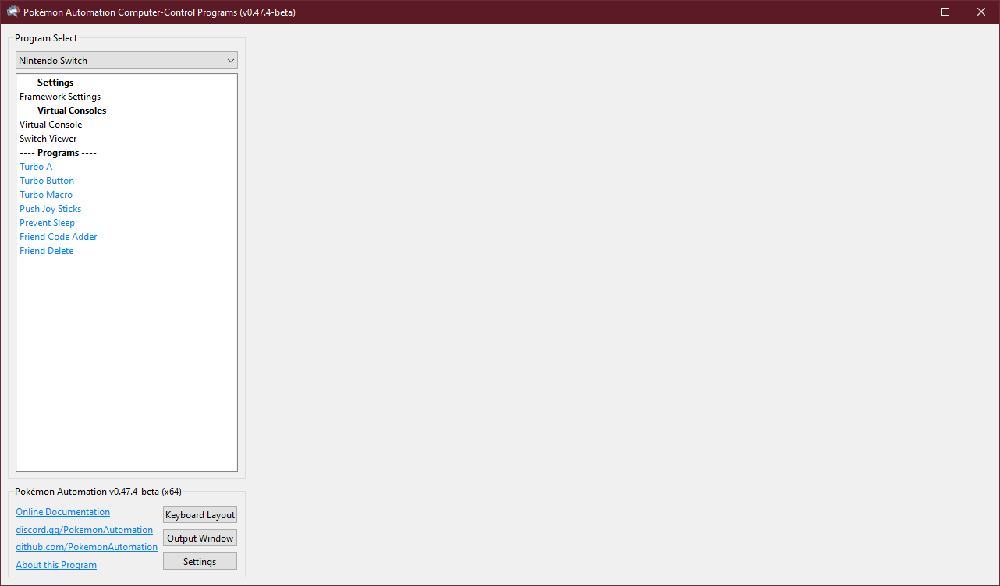
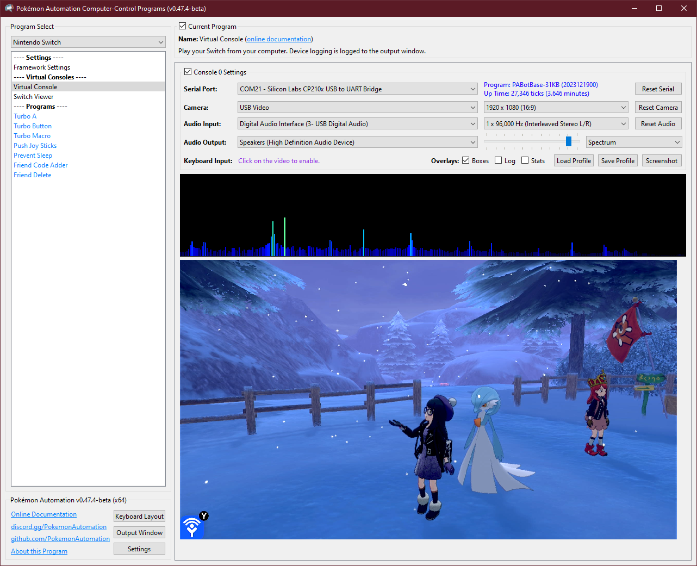
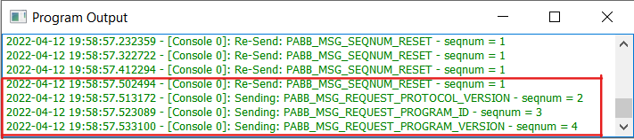
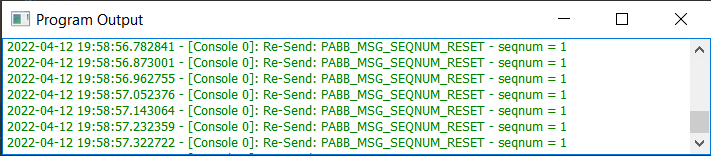
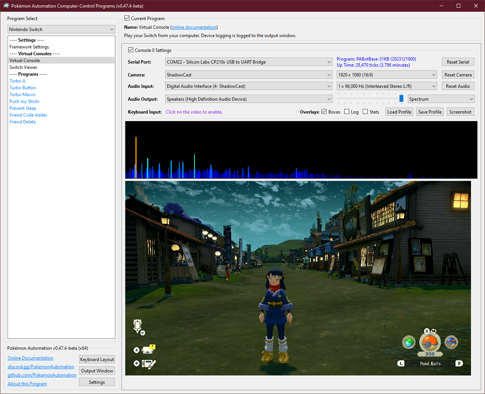
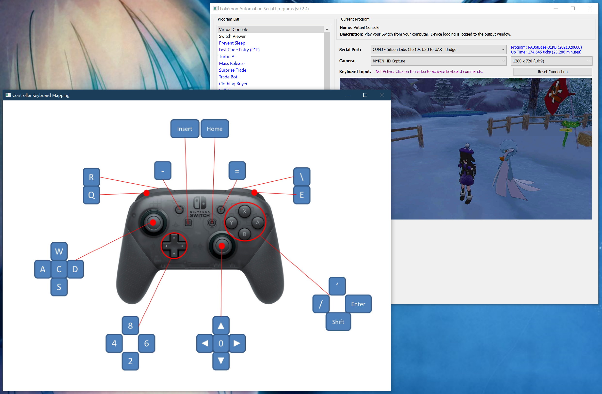

# **Part 3:** Computer Control setup

| Automation Set-up Guide for Beginners |
| --- |
| [Introduction](/README.md)|
| **Part 1:** [Hardware needed](/Setup/HardwareNeeded/HardwareBeginner.md)|
| **Part 2:** [Microcontroller](/Setup/Microcontroller/Microcontroller-Beginner.md)|
| **Part 3:** [Computer control](/Setup/ComputerControl/ComputerControl-Beginner.md) (this page)|
|Video - Guide to Pokemon Automation set-up: https://youtu.be/DFXZzWkOEMs|

---

Below you will find information on how to setup and use the rest of the hardware you bought in STEP 1.

## How it works

In order to use computer-control programs, your computer needs to be able to control your game console (duh!).

The way we do it is by using a serial connection[^1] to connect the microcontroller to the computer. This allows the computer to take control of your game console. But some programs also need to see the screen! So a video capture card is also needed.

## Before you Begin

Before you begin, make sure you meet all of the following requirements:

1. You have a regular Switch (not a Switch Lite) if you want to use programs requiring video feedback.
   - Note that Switch Lite cannot output video. Therefore it cannot run any programs that require video capture. If you wish to pursue this level of automation, it might be worth considering investing in a full Switch.
2. You have a working microcontroller setup and you know how to run microcontroller programs. (See [Step 2](/Setup/Microcontroller/Microcontroller-Beginner.md))
   - **Do NOT skip the Microcontroller tutorial**, even if you have no intention to run Microcontroller programs. The Microcontroller tutorial provides basic information needed for both Microcontroller and Computer-Control programs.
3. You have a computer running 64-bit Windows, and it is Windows 10 or later. 
      * As of this writing, no platforms other than 64-bit Windows are supported.
4. Your computer must be sufficiently powerful:
      - If you intend to control **1** Switch: A dual-core processor @ 3 GHz no older than 2015 should be sufficient.
      - If you intend to control **2** Switches: A quad-core processor @ 3 GHz no older than 2015 should be sufficient.
      - If you intend to control **4** Switches: 6-8 cores minimum.

## Step 1: Hardware Assembly

Once you have your hardware, you need to make some connections between your UART cables and the Leonardo. Use the jumper wires you bought to connect the two.

Make the following connections:
| **UART pin** | **Adafruit UART Wire Color** | **Arduino Leonardo pin** |
| --- | --- | --- |
| TX | Green | RX <- 0 (pin0) |
| RX | White | TX -> 1 (pin1) |
| GND | Black | GND (any one is fine) |
| VCC | Red | Leave unconnected |

> **If you did **not** buy the Adafruit UART, your wire colors will be different!** Refer to your UART's manual or board for the correct pins. Often, with CP210x modules, the pin type is written on the board itself. Also, note that the color of the jumper wires do not matter.

## Step 2: Download the SerialPrograms package.

1. Download the latest version of our programs from [here](https://github.com/PokemonAutomation/ComputerControl/releases).

> (The link should look like something like `PA-SerialPrograms-0.x.x-xxxxxxxx.zip`)

   * If you get a virus or malware warning, ignore it. These are known false positives. If you don't trust us, the [source code is here](https://github.com/PokemonAutomation/Arduino-Source/tree/main/SerialPrograms).

2. Once you have downloaded the package, unzip to somewhere you can access later. **Do not put it on Microsoft OneDrive.**

## Step 3: Flash PABotBase into your Device.

The root folder of the SerialPrograms package should have a set of .hex files for each of the different devices.

1. Run the QMK Toolbox program that you downloaded in PART 2.
2. Open the .hex named `NintendoSwitch-PABotBase-2021052611-ArduinoLeonardo.hex` located in the root of the folder you downloaded and unzipped.
3. Change the MCU to `atmega32u4`.
4. Check the "Auto-Flash" box.

5. Plug the Leonardo into your computer.
6. Press the reset button.

The QMK program will now flash the program to the Leonardo and show a bunch of logging.
Afterwards, the 3 LEDs on the Leonardo should flash in unison for 5 seconds before turning off.

7. Unplug the Leonardo from your computer.

## Step 4: Setup the serial connection.

1. Turn on your Switch.
2. Connect your Arduino Leonardo to the Switch's dock or to its USB-C hub.
3. Connect the UART to your computer.

## Step 5: Setup the video capture.

1. Connect an HDMI cable from your Switch dock to your video capture card.
2. Connect your capture card to your computer.

Here is an example of a setup after steps 4 and 5.

## Step 6: Open up SerialPrograms.

1. Run the `SerialPrograms-Windows.cmd` script.

2. Under the "Serial Port" dropdown, select `COM# - Silicon Labs CP210x USB to UART Bridge`.
   - TROUBLESHOOTING: If your UART isn't being recognized, you may need to install the following drivers for your UART:
     - SiLabs CP210x: https://www.silabs.com/documents/public/software/CP210x_Windows_Drivers.zip
3. Under the "Camera" dropdown, select your video capture device.

## **Troubleshooting:**

If nothing shows up for Serial Port or Camera, then there is something wrong with your setup.

### Common serial connection errors:
- TX/RX are backwards. Try switching the TX and RX connections. Double check your wires from Step 1.
- Wrong drivers installed. Download and install the CP210x drivers as above in Step 5.
- Bad wiring. Double check that all wire connections are snug.
- Didn't flash the .hex properly.
- The serial port is in use by another program.
- The device is not running a compatible program.
- Using a UART with Prolific controller. These don't work. Get one with CP210x controllers instead. Refer back to the Hardware guide in Step 1.
- Defective UART.

### Trouble shooting serial connections:

Step 1: Plug the Arduino Leonardo into the Switch without connecting the UART to the computer.
| Error | Solution |
| --- | --- |
| Device flashes rapidly for 5 seconds, then stops | Proceed to "Step 2" below. |
| Device doesn't turn on the LED at all | The .hex isn't properly flashed. Return to the Microcontroller instructions. Also, check that the Switch dock is connected to power. |
| LED turns on and stays on | Usually means it's not properly connecting to the Switch. Ensure your Switch is turned on and try redocking your Switch. |

Step 2: Plug the UART side into the computer and select it in the dropdown.
| Error | Solution |
| --- | --- |
| Blue status text that says, "Program: PABotBase..." | No error. You're done! |
| "Incompatible version..." | Please flash the PABotBase .hex that came with that version of the program. |
| "PABotBase level not met" | You have the wrong program flashed to the device. Flash the PABotBase in the included folder. |
| "Not connected" | You either chose the wrong COM port or your drivers are messed up. |
| Stuck on "Connecting..." | If the device is not flashing the LEDs and either stays off or on, it means the line from computer -> device is broken. Make sure you chose the correct COM port and double check your wiring. Try swapping TX and RX since they are commonly mixed up. |
| Stuck on "Connecting..." | If the device is alternating two of the LEDs (Leonardo models), it means the device is receiving the commands from the computer, but the computer isn't hearing back from the device. In other words, the line from device -> computer is broken. Double check your wiring is snug and connected. |
| Stuck on "Stopping..." | Ensure your Switch dock is connected to power. |

### Output Window (Log):
1. Spamming of "RESET" messages with nothing else
   - Check your wires
2. Spams of invalid length and CRC errors.
   - Check your wires.
   - Make sure you don't have a PLxxx UART Controller (If you do, you need to buy a CP21xx UART)

**Correct output window:** 

**Incorrect output window:** 

### Common video capture errors:
- The capture card is in use by another program. Close OBS or any other program potentially using the card.
- The capture card is not receiving enough power over the USB connection.
- There are multiple capture cards connected to the same physical USB port on the computer (by means of a hub). (see [multiple capture cards](#multiple-switch-considerations))
- The USB port is broken or does not provide enough power to the capture card. Try other USB ports.
- Check your connection is secure for cables and capure card.
- The HDMI cable may be broken. Try a new cable.

To rule out possible video capture errors:
- Check if the PC sees the capture card via Windows Device Manager (or other device management software).
- Check if the video stream is available on OBS (or other streaming software).

## Step 7: Setup sound.

In the past, the program didn't support sound at all. So you needed to play it using Windows itself.
This has since changed. Not only do we support audio, some programs *require* sound to work correctly.

The sound options are below the Camera options. Most of these options are self-explanatory.
1. Select the Audio Input that comes from your capture card. If you don't know which one it is, try all of them.
2. Select the Audio Output for your speakers.
3. The slider is for playback volume. It has no effect on sound recognition. You can even mute it.

Audio output is completely optional. It is only for playback. Audio input is optional for programs that don't use sound recognition.

**Notes:**

- Some high-end capture cards (such as AVerMedia) do not have audio inputs. They use a proprietary system that fuses the audio channel with the video. Since we do not support this, you will need to run an audio cable from your Switch's headphone jack into your computer's line-in or microphone jacks.
- Due a quirk* with many cheap capture cards (including the ones we recommend), the left and right audio channels may be reversed. If this is the case for you, try the other "Interleaved Stereo" format.

\*This "quirk" causes both Windows and OBS to treat these capture cards as mono-channel audio. While we are able to recover the stereo output by separating the left/right audio channels, we can't always determine which is which - hence the reversed left/right channels.

## Step 8: Play around with the keyboard controls.

If you make it here, then both your serial connection and your video is working. Congrats! Now it's time to play with the program.

The default program is the Virtual Console. It simply displays the video from your Switch. If you click on the video, it will also activate keyboard controls so you can send button presses to the Switch. This allows you to play your Switch on your computer. Consequently, this also allows full remote access to your Switches.

To view the keyboard/controller mapping, click on "Keyboard Layout" in the bottom left section of the program.

The joystick mappings should be fairly standard for FPS and 3D adventure games. The remaining buttons are somewhat arbitrary and not necessarily intuitive.
As of this writing, there is no support for changing the key mapping.

The playability of this will depend drastically on the quality of your capture card. Some capture cards have very low video latency. Other cards may be too slow to play on the computer in real time. Regardless, even if it is slow, you can use the program for remote access to setup and run programs while you are away.

**Note:** Since `Shift` is mapped to the B button, you will need to disable Sticky Keys in the system. Alternatively, you can press `CTRL` for B. Some buttons have multiple keyboard keys that can be used to invoke it, but they are undocumented at this time.

## Step 9: Run a program.

Now that you know how to use the Virtual Console, you can try running some programs on the left panel. The first thing that you will notice is that every program is a virtual console!

Most of the current programs are identical to the native ones as they were directly ported from device code to computer. Only this time, you can configure and run them with a few clicks. There is no more need to flash the device every time you change programs!

You will notice that the programs are color-coded:
- **Black:** Not a real program.
- **Blue:** Program does not use video feedback. It can run on all devices (including Arduino Uno R3).
- **Red:** Program does not use video feedback. It cannot run on the Arduino Uno R3.
- **Green:** Program uses video feedback and requires video capture. It can run on all devices (including Arduino Uno R3).
- **Purple:** Program uses video feedback and requires video capture. It cannot run on the Arduino Uno R3.

Program List: https://github.com/PokemonAutomation/ComputerControl/blob/master/Wiki/Programs/README.md

## Next Steps

None. You're done!

 

## Notes

### The application can connect to the microcontroller programs.

This tutorial assumes that the device is running PABotBase. In reality the application will still recognize any of the [microcontroller programs](https://github.com/PokemonAutomation/Microcontroller) running on the device provided that the protocol versions are compatible.

PABotBase is the only program that will accept commands over serial, so you will not be able to control the other programs. However, logging from the program will appear in the output window.

### Programs do not always need to start in the grip menu.

Many of the programs in SerialPrograms are identical to the native ones that don't require serial. However, you don't always need to start them in the grip menu.
The purpose of the grip menu is to disconnect your manual controller so that the device can take over as the primary controller. But if you're using the keyboard to control your Switch, the device is likely already the primary controller. Therefore, some programs will work anyway if you can start them in the Switch Home menu or inside the game.

### Multiple Switch Considerations

If you have played with the Switch Viewer program, you will notice that it supports multiple Switches. This is a precursor to future releases that may have programs that utilize multiple Switches simultaneously.

However, we have found that setting up the hardware to handle multiple serial ports and capture cards can be tricky. Sometimes they work, sometimes they don't. And it's often difficult to troubleshoot. This is regardless of whether you are running multiple Switches under the same instance or if you are running multiple instances of one Switch each.

**Serial ports and Cameras can only be used at one place at a time.**

Both serial ports and cameras (capture cards) can only be used by one application at a time. Therefore you cannot view the same video capture from both OBS and SerialPrograms simultaneously.
If you would like to use OBS to stream Pokémon automation, you need to let OBS stream the video window of our program.
Double clicking on the stream view of our program will pop up the stream view as an independent window. You can then use OBS to capture this window.

The single-use limitation also applies within the same application. When viewing multiple Switch setups simultaneously, both the serial ports and cameras can only be used at one place at a time. If you try to use the same serial port on a second setup, it won't connect. If you try to use the same camera on a second setup, it won't display.

**Capture Cards don't always play well with USB hubs.**

Capture cards are very hit-and-miss when you try to put multiple of them on the same USB hub.

Some general observations:
1. Capture cards draw a lot of power. If you put them with other high-powered USB devices drawing power from the same source, the card may not function.
2. Capture cards use a lot of USB bandwidth. If you put multiple capture cards on the same USB hub, you may saturate the bandwidth on that hub.
3. For some unknown reason (even when both the above do not apply), it can be difficult to get multiple capture cards on the same physical USB port (by means of a hub) on the computer to work simultaneously. You may need to spread them out. Thus for a 4-Switch setup, your computer will need at least 4 USB ports - one for each capture card. But within each port, you can use a hub to connect *one* capture card and other devices as well. (such as the UART serial connections)

**Discord Server:** 

[^1]: https://en.wikipedia.org/wiki/Serial_port
