# **Part 3:** Computer Control setup - experienced users

If you're reading this page, we assume you are a user that is experienced with microcontrollers.

**First, read the [beginner guide to computer control setup](./ComputerControl-Beginner.md) to understand how the Serial programs are setup.** This page only provides supplementary information to the beginner guide.

## Before you Begin

Before you begin, make sure you meet all of the following requirements:

1. You have a regular Switch (not a Switch Lite) if you want to use programs requiring video feedback.
2. You have a working microcontroller setup and you know how to run microcontroller programs. (See [STEP 3]((/Setup/Microcontroller/Microcontroller-Experienced.md)))
   - **Do NOT skip the Microcontroller tutorial**, even if you have no intention to run Microcontroller programs. The Microcontroller tutorial provides basic information needed for both Microcontroller and Computer-Control programs.
3. You have a computer running 64-bit Windows, and it is Windows 10 or later. 
4. Your computer must be sufficiently powerful.

Refer to the [Beginner guide](./ComputerControl-Beginner.md) for more details.

## Step 1: Hardware Assembly

- If you are using the Arduino Leonardo, refer to the [Beginner guide](./ComputerControl-Beginner.md).
- If you are using the Teensy 2.0/Teensy++2.0 or Pro Micro, continue reading.

### Option 1: UART Cable + Mini-Grabber Cables

This option is the easiest to setup, however the mini grabber cables that are needed are rarely in stock.

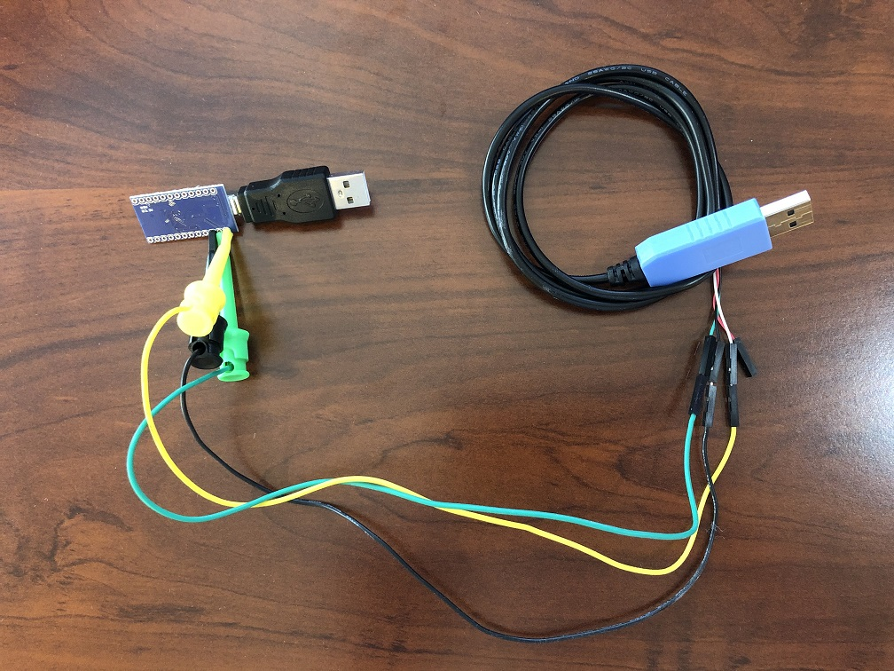

**Required Hardware:**
1. The microcontroller hardware
2. A USB-to-TTL UART cable or board. It is recommended to get one with the CP210x controller.
> ***Avoid the Prolific (PLxxxx) controllers. Many of them are knock-offs that do not work.***
3. Mini grabber to jumper wires (male). You want the one with ***male*** jumper wires.

Refer back to the [Hardware guide](../HardwareNeeded/HardwareExperienced.md) for more details.

**Hardware Setup:**

Once you have your hardware, you need to make some connections.

Make the following connections:
| **UART pin** | **Microcontroller pin** |
| --- | --- |
| TX | RX (RX1 on Pro Micro, D2 on Teensy) |
| RX | TX (TX0 on Pro Micro, D3 on Teensy) |
| GND | GND (any one is fine) |
| VCC | Leave unconnected |

Note that the mini grabber clips may not fit through the holes on the Pro Micro or Teensy 2.0/Teensy++2.0. This is fine.

**Pro Micro** (click on images to enlarge)

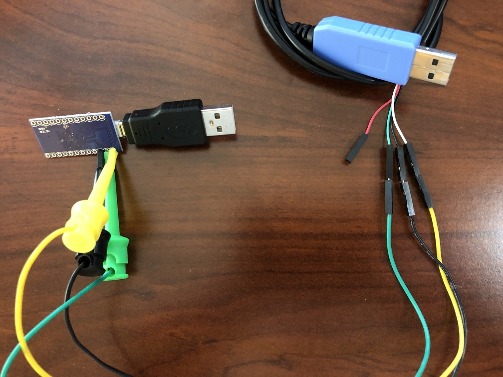 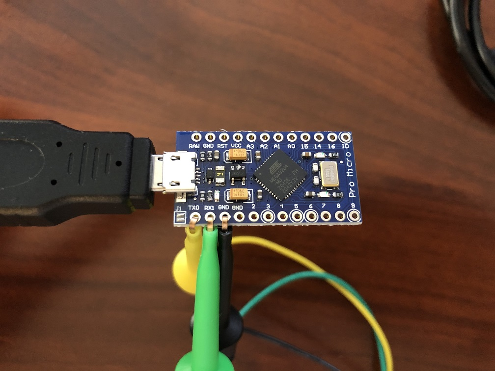

**Teensy 2.0:** (click on images to enlarge)

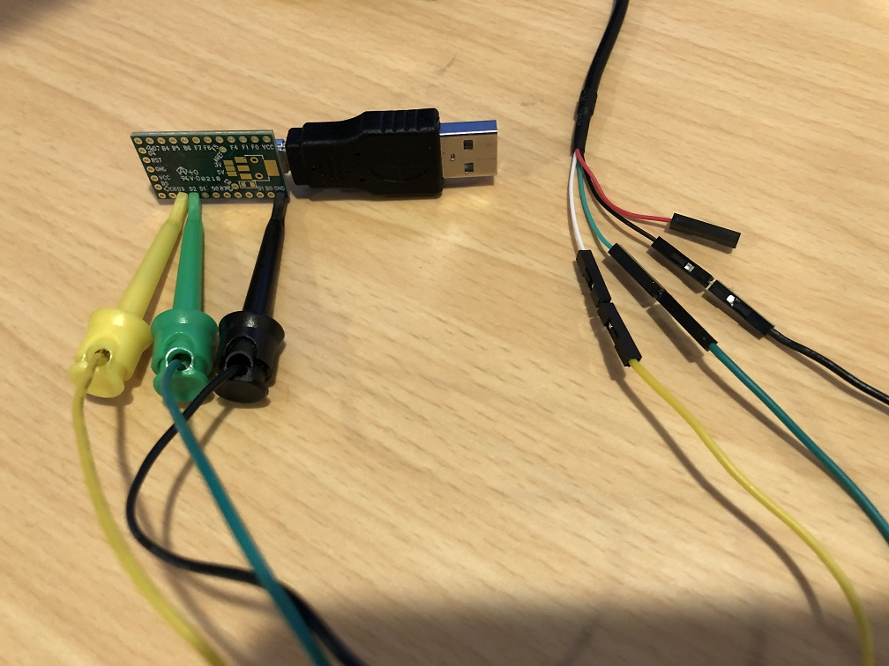 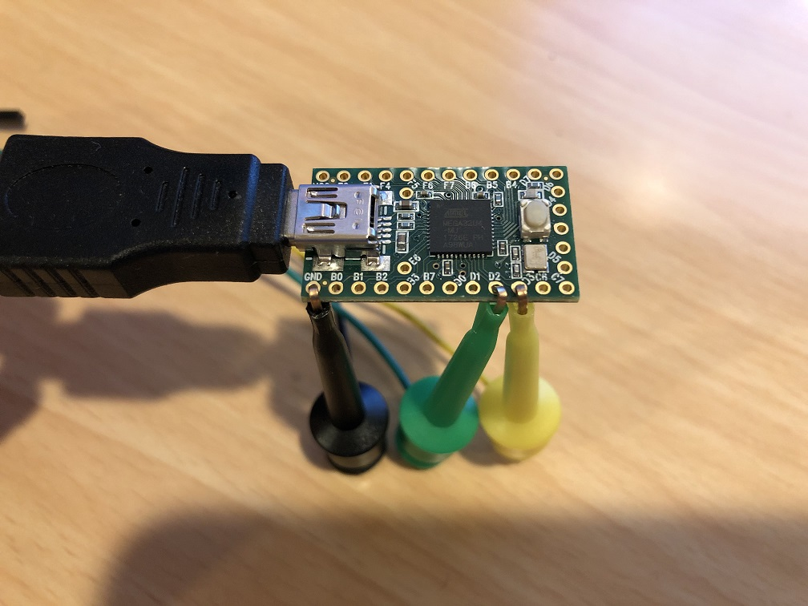

**Teensy++ 2.0:** (click on images to enlarge)

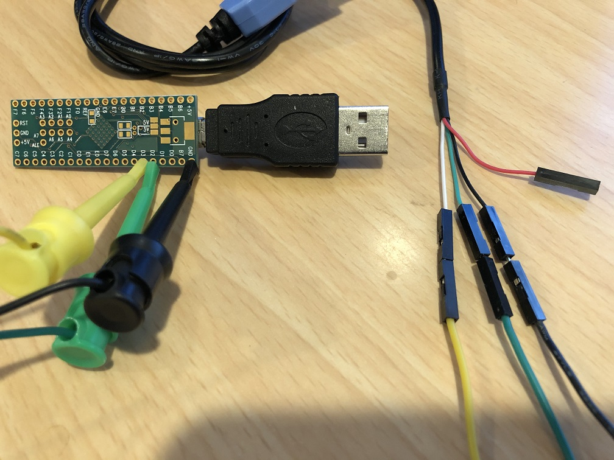 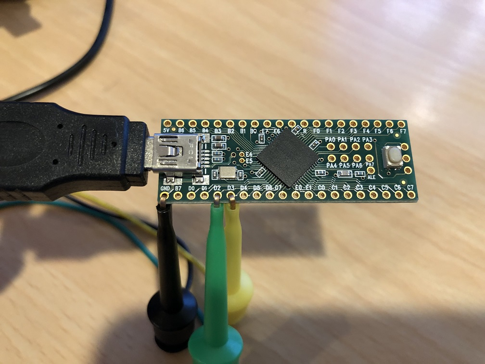

### Option 2: UART Cable + Solderless Hammer Headers

This option is cleaner, but is more involved.

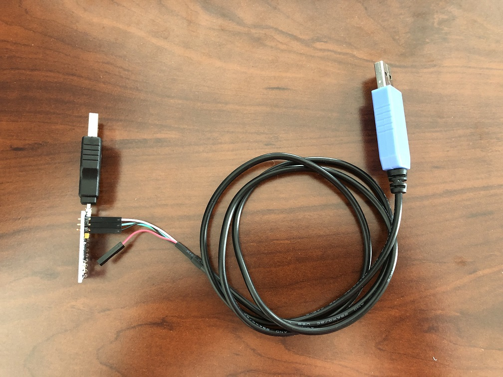

**Required Hardware:**
1. The microcontroller hardware
2. A USB-to-TTL UART cable or board. It is recommended to get one with the CP210x controller.
> ***Avoid the Prolific (PLxxxx) controllers. Many of them are knock-offs that do not work.***
3. Solderless Hammer Headers
4. A box cutter or a wire cutter.
5. Pliers. (you will likely need two of them)

Refer back to the [Hardware guide](../HardwareNeeded/HardwareExperienced.md) for more details.

**Hardware Setup:**

1. Use your box cutter or wire cutter to cut out 2 pairs of pins from the strip of solderless headers. ***Be very careful not to cut yourself.***
2. Insert a pair of hammer headers into the TX and RX holes on the microcontroller (TX0 and RX1 on Pro Micro, D3 and D2 on Teensy).
3. Insert a hammer header into the GND hole on the microcontroller. (Since you can't easily split the pair of pins, you can do GND and the pin adjacent to it.)

You will need a LOT of force to push the hammer headers into the holes. Recommend using pliers to pull the pins out of the plastic holds and inserting the long side into the microcontroller board. Then put the covers back on and use pliers to squeeze it in.

Make the following connections:
| **UART pin** | **Microcontroller pin** |
| --- | --- |
| TX | RX (RX1 on Pro Micro, D2 on Teensy) |
| RX | TX (TX0 on Pro Micro, D3 on Teensy) |
| GND | GND (any one is fine) |
| VCC | Leave unconnected |

**Pro Micro** (click on images to enlarge)

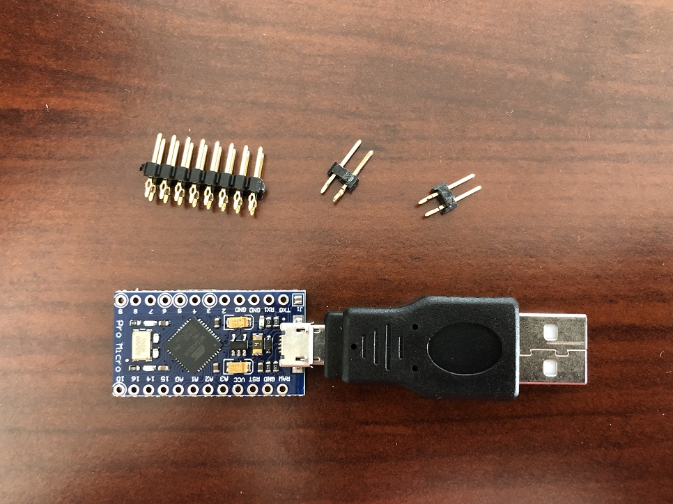 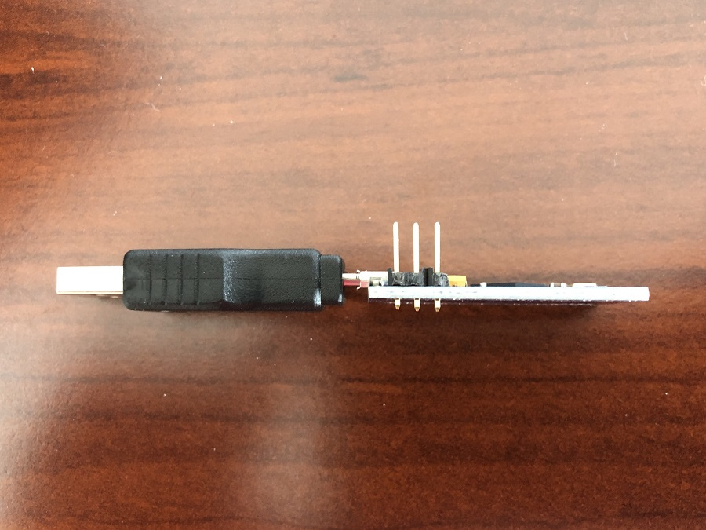

**Teensy 2.0/Teensy++ 2.0:** (click on images to enlarge)

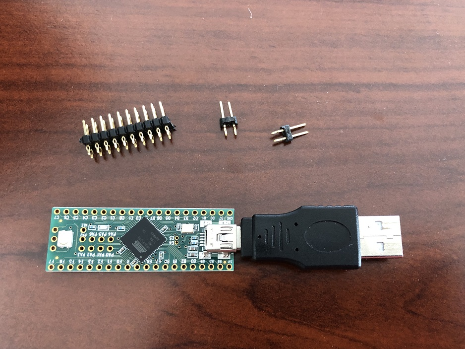 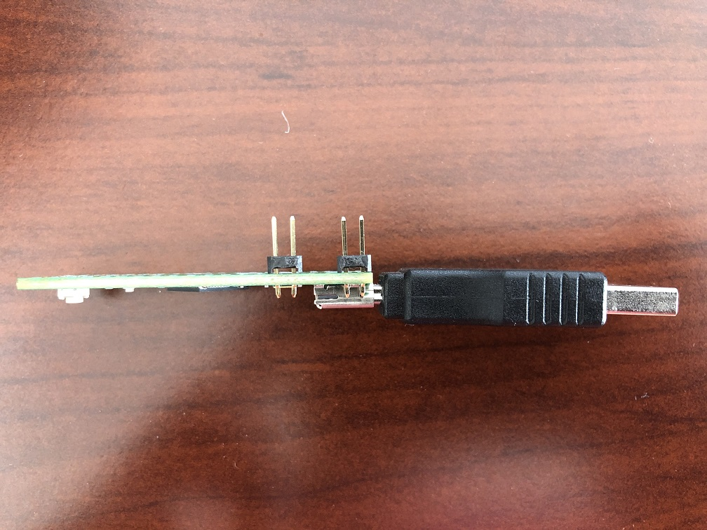

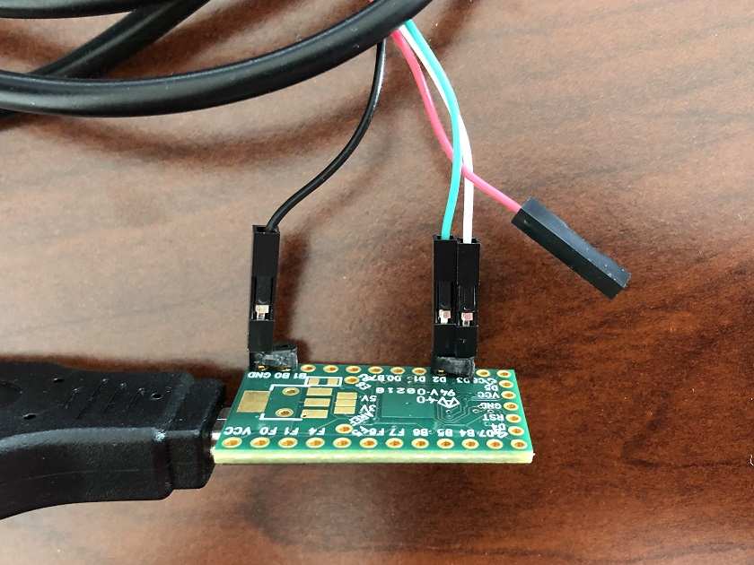 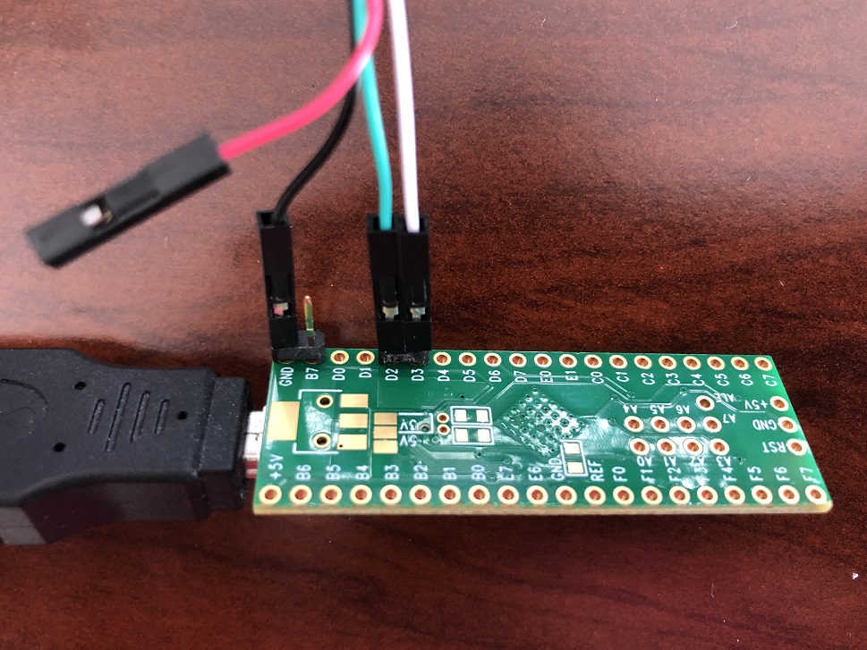

## Step 2: Download the SerialPrograms package.

Download the latest version of our programs from [here](https://github.com/PokemonAutomation/ComputerControl/releases).

Refer to the [Beginner guide](./ComputerControl-Beginner.md) for more details.

## Step 3: Flash PABotBase into your Device.

The root folder of the SerialPrograms package should have a set of .hex files for each of the different devices.

Flash the appropriate one to your device.

***If you do not know how to do this, it means you skipped the [Microcontroller tutorial](../Microcontroller/Microcontroller-Experienced.md). STOP right now and go back to the Microcontroller tutorial.***

## Step 4: Setup the serial connection.

1. Turn on your Switch.
2. Connect your device (Teensy/Pro Micro/Arduino) to the Switch or its dock.
3. Connect the UART to your computer.

**To install SiLabs CP210x on macOS:**
After unzip the downloaded .zip folder, run SiLabsUSBDriverDisk.dmg inside.
It will launch an installation GUI. Click through it to start the installation progress bar.
If you feel the progress bar is stuck, it may be macOS is preventing it from modifying the OS.
Go to System Preferences App and choose Security & Privacy.
You will see some text saying things like "macOS is preventing SiLabs CP210x drivers".
Click the lock icon in the lower left of the window, enter your password. Then click the button to allow the driver to modify the system.
After that, you will see the driver GUI shows installation success.

## Step 5: Setup the video capture.

1. Connect an HDMI cable from your Switch dock to your video capture card.
2. Connect your capture card to your computer.

Here is an example of a setup after steps 4 and 5.

## Step 6: Use SerialPrograms.

For macOS users, follow this [guide](ComputerControl-Mac.md) to build the program first.

1. For Windows users, simply run the `SerialPrograms-Windows.cmd` script.

If you get any errors about "MSVCP140.dll" or "VCRUNTIME140_1.dll", you may need to install the [MSVC redistributable (x64)](https://learn.microsoft.com/en-us/cpp/windows/latest-supported-vc-redist?view=msvc-170). (direct download: https://aka.ms/vs/17/release/vc_redist.x64.exe)

2. Under the "Serial Port" dropdown, select your serial device.
   - TROUBLESHOOTING: If your UART isn't being recognized, you may need to install the following drivers for your UART:
     - SiLabs CP210x: https://www.silabs.com/documents/public/software/CP210x_Windows_Drivers.zip
3. Under the "Camera" dropdown, select your video capture device.

If everything worked correctly, it should look like this.

Refer to the [Beginner guide](./ComputerControl-Beginner.md) for more details, particularly for troubleshooting.

## Step 7: Setup sound.

The sound options are below the Camera options. Most of these options are self-explanatory.
1. Select the Audio Input that comes from your capture card. If you don't know which one it is, try all of them.
2. Select the Audio Output for your speakers. This is optional.
3. The slider is for playback volume. It has no effect on sound recognition. You can even mute it.

Refer to the [Beginner guide](./ComputerControl-Beginner.md) for more details

## Step 8: Play around with the keyboard controls.

If you click on the video, it will also activate keyboard controls so you can send button presses to the Switch. This allows you to play your Switch on your computer. Consequently, this also allows full remote access to your Switches.

To view the keyboard/controller mapping, click on "Keyboard Layout" in the bottom left section of the program.

Refer to the [Beginner guide](./ComputerControl-Beginner.md) for more details

## Step 9: Run a program.

Now that you know how to use the Virtual Console, you can try running some programs on the left panel. 

You will notice that the programs are color-coded. 

Program List: https://github.com/PokemonAutomation/ComputerControl/blob/master/Wiki/Programs/README.md

Refer to the [Beginner guide](./ComputerControl-Beginner.md) for more details.

## Next Steps

None. You're done!

**Discord Server:** 

