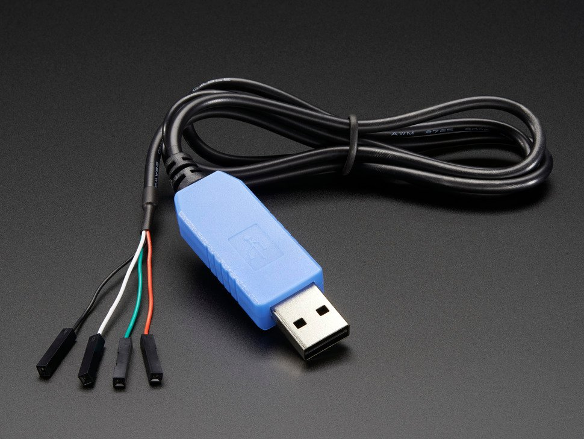
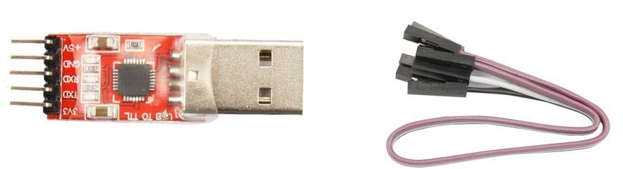
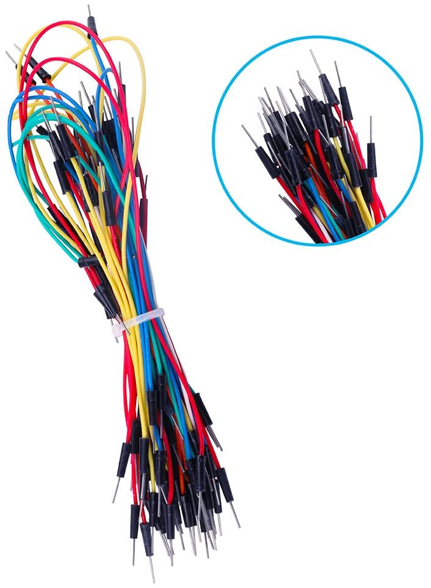

# **Part 1:** List of Hardware needed

| Automation Set-up Guide for Beginners |
| --- |
| [Introduction](/README.md)|
| **Part 1:** [Hardware needed](/Setup/HardwareNeeded/HardwareBeginner.md) (this page)|
| **Part 2:** [Microcontroller](/Setup/Microcontroller/Microcontroller-Beginner.md)|
| **Part 3:** [Computer control](/Setup/ComputerControl/ComputerControl-Beginner.md)|
|Video - Guide to Pokemon Automation set-up: https://youtu.be/DFXZzWkOEMs|

---

### **Attention: If you do not have a Windows computer...**

Due to lack of developer, our support of Mac and Linux is limited.
While you can set these programs up on Mac and Linux, you will need to know how to run command-line build scripts.

If you are not willing to do that or you have no idea what this means, then stop. Unfortunately, you will not be able to run these programs.

## (1) Select how far into automation you want to get

Select your level of automation.

| Microcontroller Only | Computer Controlled |
| --- | --- |
| Less programs available. Minimal ongoing development | More programs available. Most new development done on computer control. |
| Blindly sends button presses | Takes in video input, so it can make decisions based on what’s on screen |
|Less hardware needed. Less steps to set up | A few more pieces of hardware needed. A few extra steps to set up |
| Runs on both Switch and Switch Lite | Only runs on a Nintendo Switch | 
| [Microcontroller Program list](https://github.com/PokemonAutomation/Microcontroller/blob/master/Wiki/Programs/README.md) | [Computer control Program list](https://github.com/PokemonAutomation/ComputerControl/blob/master/Wiki/Programs/README.md) |

> **WARNING:** **Swich Lite** does *not* output video and thus programs requiring video feedback programs will *not* work (i.e. Computer control does not work with the Switch Lite). If you only have a Switch Lite, consider checking our program list (microcontroller-only[^1] and computer-controlled[^2]) to know what you want to use prior to purchase of the hardware.

We recommend most people go with the computer controlled programs, as these programs are both more reliable and more powerful. Also, development and bug fixes are ongoing with the computer controlled programs, while there is minimal ongoing development with the microcontroller programs. That being said, if the existing microcontroller programs meet all of your needs, the microcontroller setup is a reasonable option.

See [this](/MCvsCC.md) page for a more detailed comparison of Microcontroller vs Computer Controlled programs.

## (2) Basic Automation Hardware

For both Microcontroller and Computer control automation, you will need the following:

### 1. Arduino Leonardo microcontroller

- Example links
  - https://www.digikey.com/en/products/detail/arduino/A000057/3476353
  - https://www.amazon.com/dp/B008A36R2Y
  - https://www.amazon.com/dp/B0786LJQ8K
- Ensure the Arduino Leonardo comes with headers (the black squares sticking out at the top and bottom of the board, with a holes in them, as seen in the image above).
- You can get either the official Arduino Leonardo, or unofficial Leonardo clones. e.g. KEYESTUDIO

### 2. USB A to micro USB cable

- Example links
  - https://www.digikey.com/en/products/detail/cvilux-usa/DH-20M50057/13177527
  - https://www.amazon.com/dp/B07CZHV9VF/
- It may already come with your Arduino.
- You need a Micro-USB male to USB-A cable and it must support data-transfer (not just power delivery).

### 3. Switch Dock, or USB-C hub

- Example link for USB-C hub
  - https://www.amazon.com/gp/product/B07JK9DFKH
- If you have a full Nintendo Switch, you may use the official dock it comes with. In fact, the official dock is preferred.
- USB-C hubs can also work in lieu of a Switch dock, but it can also introduce issues such as problems with power delivery. So, the official switch dock is preferred for most people. If you have a Switch Lite, no official docks are available, so you'll need to get a 3rd party dock of USB hub.

## (3) Additional Hardware for Computer Control Automation

If you are only doing Microcontroller Automation, skip this section and proceed to [Part 2](/Setup/Microcontroller/Microcontroller-Beginner.md).

For Computer control automation, you will also need the following:

### i. 64-bit Windows Computer

- Your computer needs to run a 64-bit version of Windows. If you have a modern computer with Windows 10 or 11, your version of Windows is almost certainly 64-bit.
- The automation programs do use computer vision do read the Nintendo Switch video output. So, the computer needs to be moderately powerful. 
- Recommended minimum is a computer with a quad core CPU at 3 GHz, no older than 2015. If you intend to control more than 1 switch, you will need a more powerful CPU with more cores. If you want to run 4 Switches all with feedback, we recommend a modern 8-core computer.

### ii. Nintendo Switch

- As mentioned above, a Nintendo Switch (version 1 or version 2) or Switch OLED is needed. The Switch Lite does not work with the Computer Controlled programs.
- Note, that you can use regular switch, it does NOT need to be hacked. No modifications of the switch are needed.

### 1. CP210x module - USB to Serial TTL (UART)

#### Option 1: Adafruit UART

- Example links
  - https://www.adafruit.com/product/954
  - https://www.digikey.com/en/products/detail/adafruit-industries-llc/954/7064488
  - https://www.amazon.com/dp/B00DJUHGHI/
- Easiest and most straightforward option. We recommend this if available in your region.
- WARNING: **DO NOT get cables with the Prolific controllers. e.g. PL2303 or any other model number.** They are cheap, do not work, and they are explicitly blocked in the program. **They often look deceptively similar to the Adafruit UART, but they are not the same.** If you buy outside of this link, verify it does not use PL controllers. If you buy it anyway, you will be wasting your time and money. **YOU HAVE BEEN WARNED!**
- Ensure it uses CP210x chipset (e.g. CP2102). So, if the product page doesn’t mention CP210x or CP2102, then don’t buy it unless you know what you’re doing.

#### Option 2: CP210x Board/module

- Example links
  - https://www.amazon.com/dp/B072K3Z3TL
  - https://www.amazon.com/gp/product/B07D6LLX19
  - https://www.amazon.com/gp/product/B07T1XR9FT
- These are another alternative, which are more widely available. They do require some extra wiring, however.
- Ensure it uses CP210x chipset (e.g. CP2102). Again, make sure it does NOT use the Prolific chipset (e.g. PL2303). So, if the product page doesn’t mention CP210x or CP2102, then don’t buy it unless you know what you’re doing.

### 2. Male-Male Jumper Wires

- Example links
  - https://www.digikey.com/en/products/detail/twin-industries/TW-MP-10/2116120
  - https://www.amazon.com/dp/B07S1NGQR1
- If purchasing the items from this list, you will need Male to Male Jumper wires.
- **WARNING:** If you do ***not*** buy Hardware from this list, you will need to evaluate what you purchased for the correct type of Jumper Wire. e.g. Female-Male jumper wires may be needed instead.

### 3. Video capture card

- Example links
  - https://www.amazon.com/dp/B088HBRM7T
  - https://www.amazon.com/dp/B09FLN63B3
- Most cheap capture cards work. Higher end-capture cards may cause issues with color detection.
- Ensure the capture card is capable of a video output resolution of 1080p at 30 frames per second.

### 4. HDMI Cables 

- Example links
  - https://www.digikey.com/en/products/detail/bel-inc/BC-HH006F/10407217
  - https://www.amazon.com/dp/B08M9HND4F/
- Already comes with the Switch, so you may already have this.

## Next Steps
Proceed to [Part 2](/Setup/Microcontroller/Microcontroller-Beginner.md) for microcontroller setup. 

**Note:** Microcontroller setup is required even if you plan to use the computer controlled programs.

---

[^1]: https://github.com/PokemonAutomation/Microcontroller
[^2]: https://github.com/PokemonAutomation/ComputerControl
