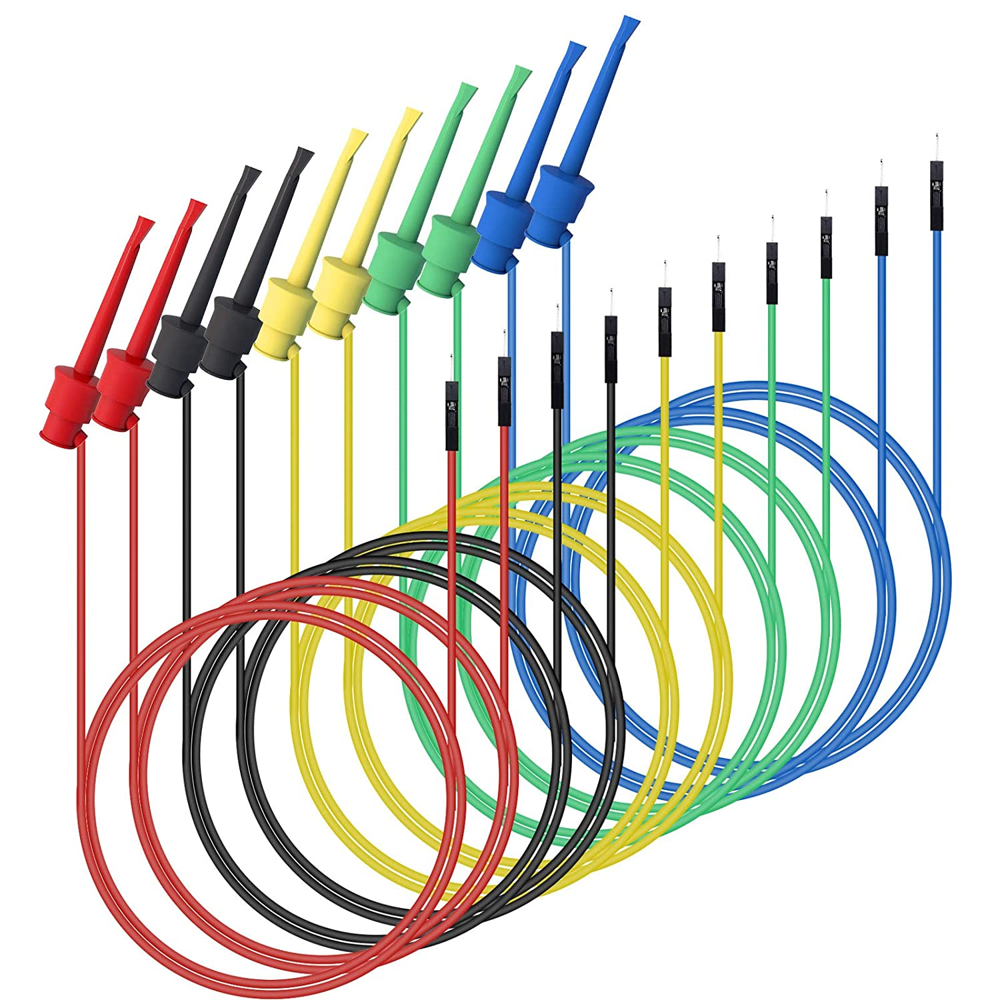
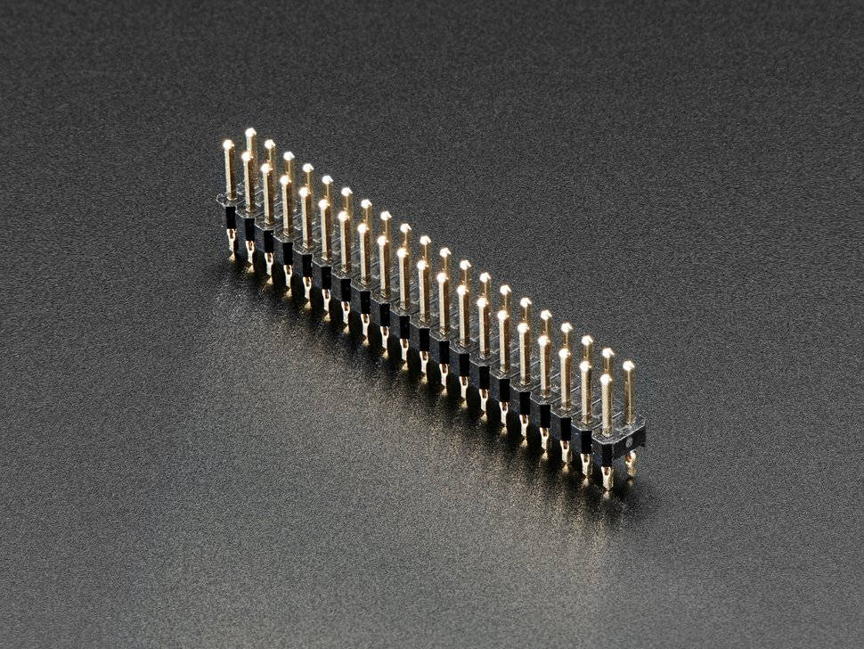
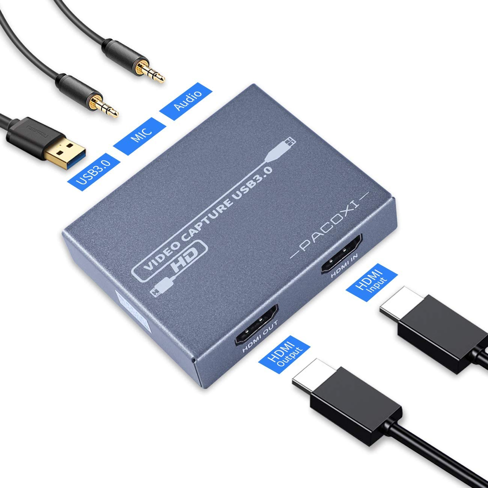

# **Step 1:** List of Hardware needed - experienced users

If you're reading this page, we assume you are a user that is experienced with microcontrollers.

**First, read the [beginner hardware page](./HardwareBeginner.md) to understand the general hardware requirements.** This page only provides supplementary information to the beginner guide.

Next, we'll go over alternate hardware configurations.

## Hardware needed for Microcontroller automation

### Microcontroller Hardware

- For the microcontroller, you have the following options:
  - [Arduino Leonardo](https://www.amazon.com/gp/product/B0786LJQ8K), 
  - [Teensy2.0](https://www.pjrc.com/store/teensy.html) / [Teensy2.0++](https://www.pjrc.com/store/teensypp.html)
  - [Pro Micro](https://www.amazon.com/gp/product/B08BJNV1J3)
- The Arduino Leonardo is what we recommend for beginners. If you decide to go with this, you can refer back to the beginners guide.
- Teensy 2.0/2.0++ used to be another good option. Unfortunately, it has now been discontinued, so it's hard to find. However, it can still be a good option if you find one for a good price.
- The Pro Micro is often cheaper per unit than the Arduino Leonardo. It is also smaller. So, it can be good option if you want to automate multiple Nintendo Switches.

### Other hardware needed
- USB A to micro USB cable with power delivery
- Switch Dock, or USB-C hub

## Additional Hardware for Computer Control Automation

### Serial Board Connectors

> There are many ways to set this up with varying cost and difficulty. Here we will present some simple options that do not require soldering. If you are experienced with electronics, feel free to do your own thing.

- If you're getting the Arduino Leonardo, refer back to the beginners guide. You can just get male-male jumper wires.
- If you're getting the Teensy 2.0/2.0++ or Pro Micro, consider getting *one* of the following Board Connectors:

| [Mini-Grabbers to Male Jumper Wires](https://www.amazon.com/gp/product/B08M5GNY47) | [Solderless Hammer Headers](https://www.adafruit.com/product/3662) | [Hammer Headers](https://www.adafruit.com/product/2822) | 
| --- | --- | --- |
| Easiest option, but hard to find. | Fairly easy to install. These must have a bulge on the short side. | Most difficult. Will require soldering. |
| No soldering. Best for beginners. | Doesn't require soldering. | Requires soldering. Experienced only. |
|  |   |

### Video Capture card
**Choose one based on your needs**
- Capture Card without TV output (Budget buy) ([example](https://www.amazon.com/dp/B097R3PB36))
  - The cheapest ones can be less than $10. However, they have no TV output, are limited to USB 2.0 bandwidth, and may have video quality issues.
- Loop-Out Card (Good middle ground) 
  - if you want a tolerable video quality you'll want one that uses USB 3.0.
- Pass-Through Card (If you want to live-stream) ([example](https://www.amazon.com/product/dp/B08L64XT3J/))
  - If you want to display the video both on your TV and in your computer, you will need one with TV output with pass-through.
  - The more expensive ones can be over $100. These support TV output and use USB 3.0 or PCIe. These are meant for livestreaming.

Note: For the purposes of Pokémon automation, the cheapest capture cards ([example](https://www.amazon.com/gp/product/B088HBRM7T)) appear to be sufficient. But if you want a tolerable video quality you'll want one that uses USB 3.0. And if you want to display the video both on your TV and in your computer, you will need one with TV output with pass-through. Each of these will add to the cost.

Note: **DO NOT** purchase AverMedia capture cards! Those cards use an old API that is no longer supported by our program after v0.14.

### Capture Card Type Explanations

#### Capture card without TV output:

Display video only with your computer. (Price Range: $10 - $20; depending on USB 2.0 or 3.0)

#### Capture card with TV output:

Display video both on TV and in your computer.

**Pass-Through vs. Loop-Out:**

Capture cards with both computer and TV output come in two flavors:
- Pass-Through
- Loop-Out

Pass-Through cards are generally more expensive, but they have the lowest latency from the console to the computer (even lower than the capture cards without TV output).

If you intend to do any serious gameplay from your computer, it is highly recommended to get a pass-through card even if you don't intend to display to a TV. Loop-out cards and cards without TV output have a high enough latency that it may be difficult to play on the computer.

### Other hardware needed
- Computer running 64-bit Windows. With a minimum of quad core CPU at 3 GHz, no older than 2015. If running 4 Switches, we recommend a modern 8-core computer.
- Nintendo Switch (version 1 or version 2) or Switch OLED. Switch Lite will not work.
- CP210x module - USB to TTL Serial (UART)
- HDMI cable

## Next Steps
**Again, ensure that you have read the [beginner hardware page](./HardwareBeginner.md).**

Then, proceed to [step 2](/Setup/Microcontroller/Beginner-Windows-ArduinoLeonardo.md) for microcontroller setup. 

**Note:** Microcontroller setup is required even if you plan to use the computer controlled programs.

