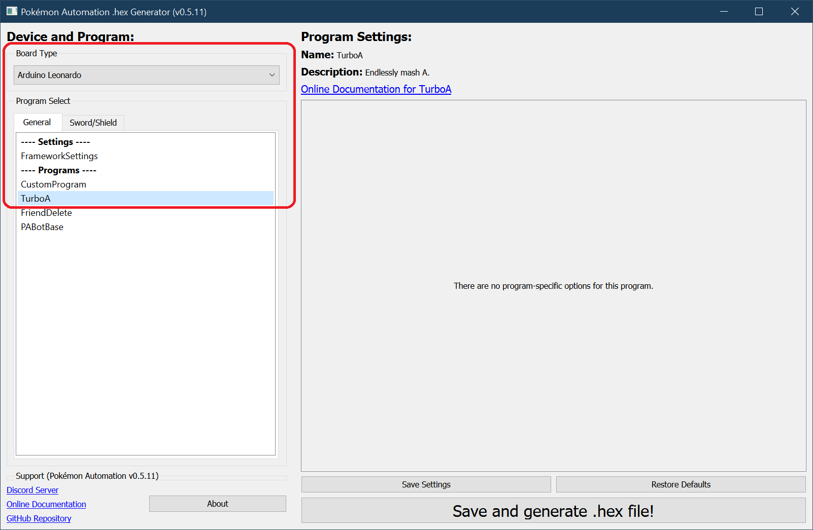
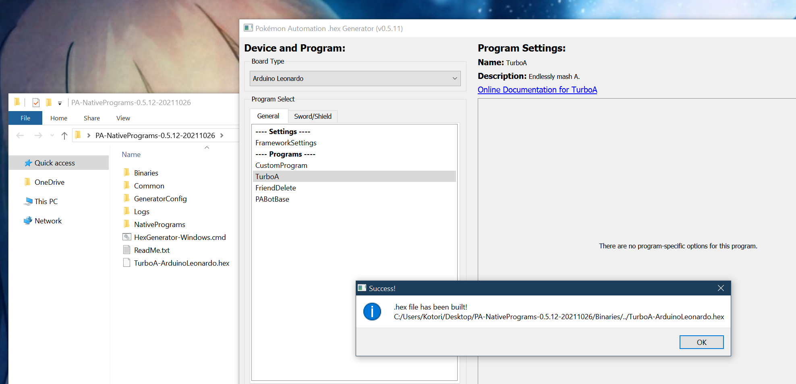
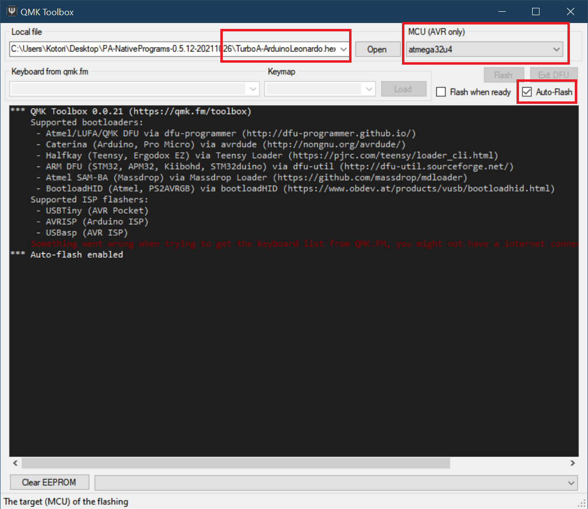
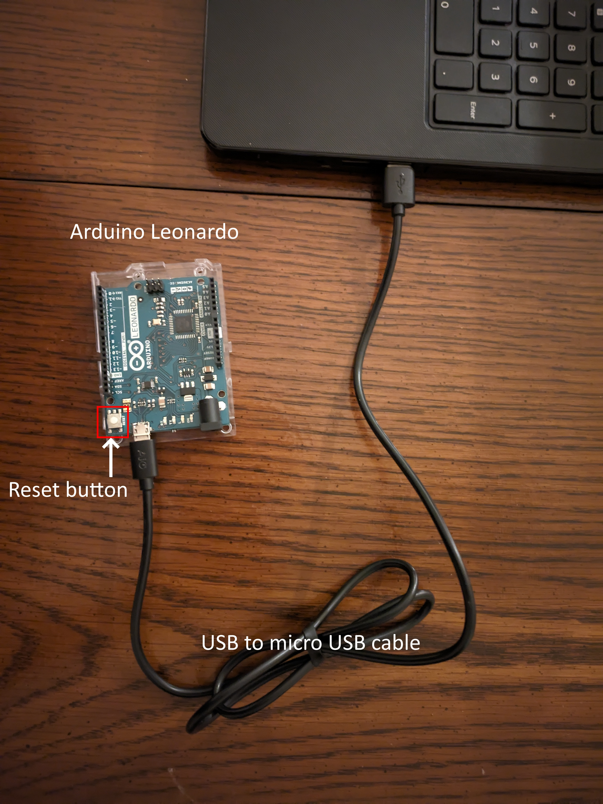
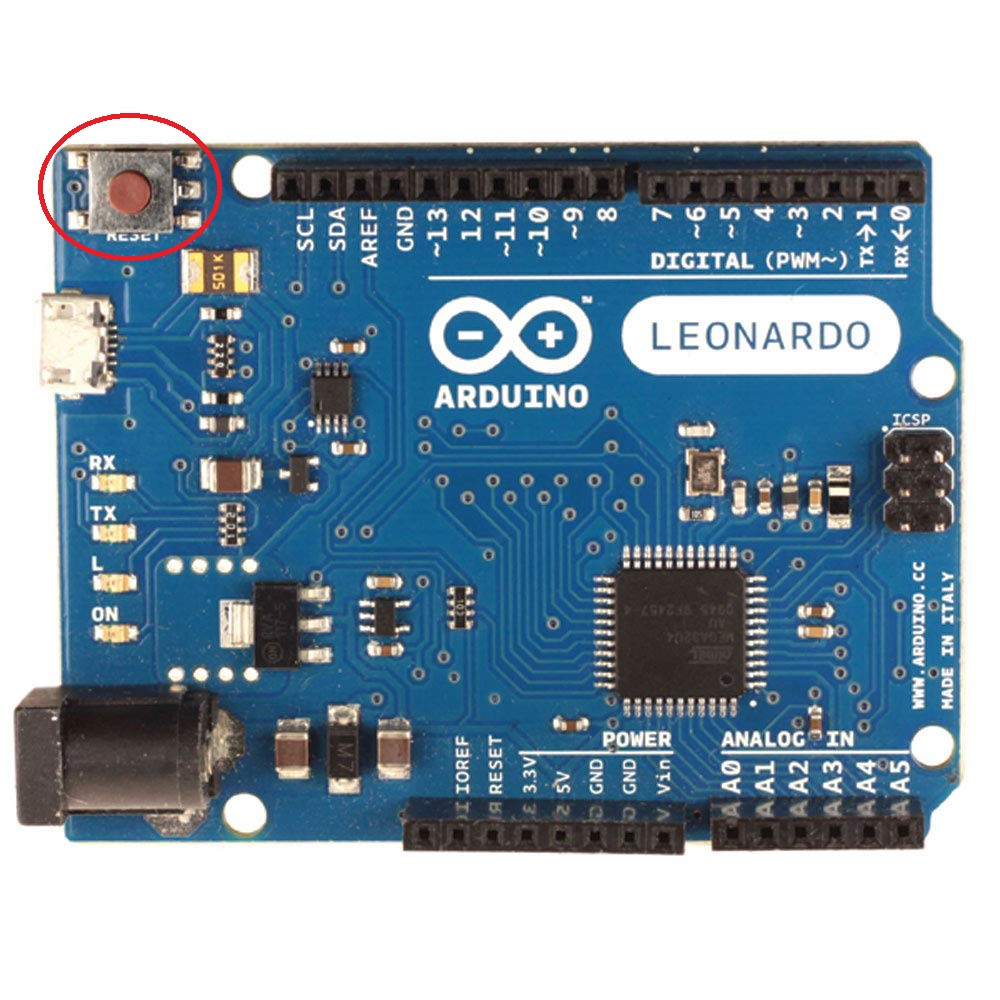
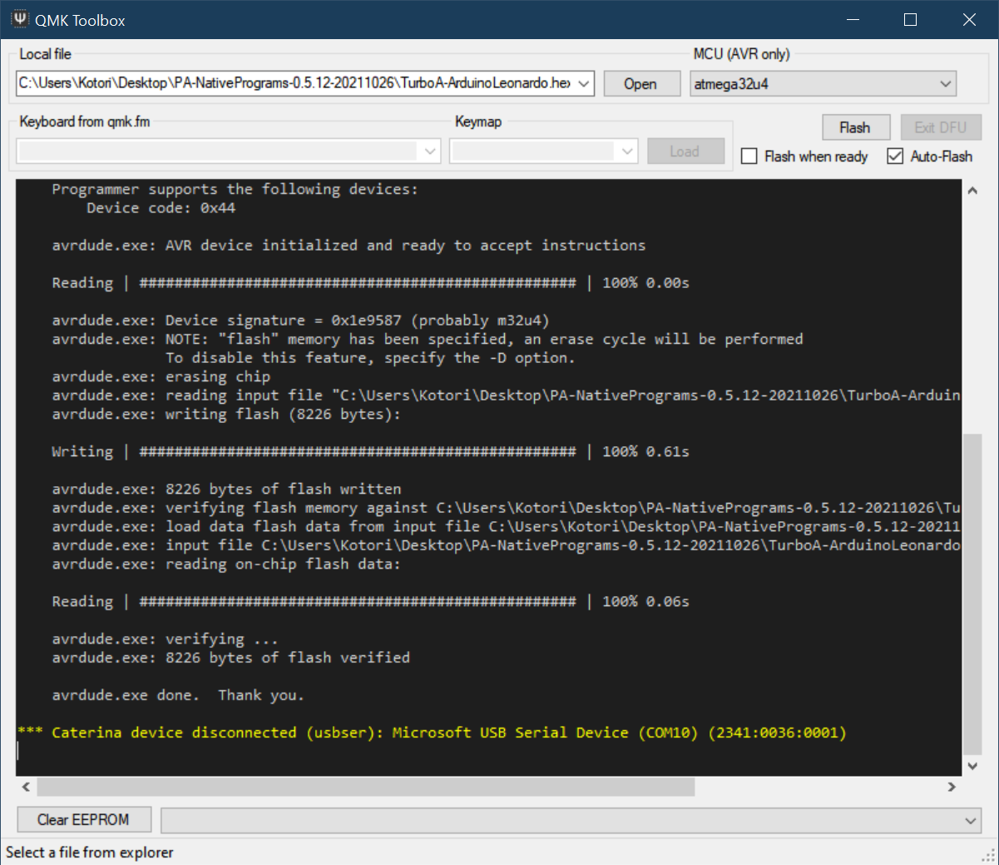
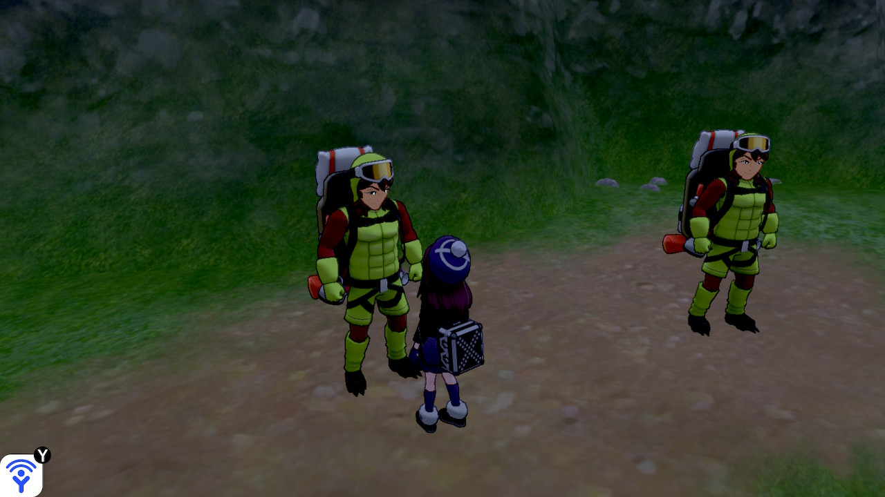
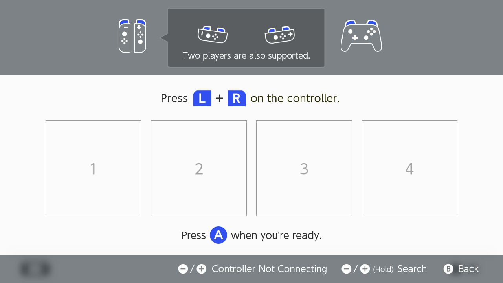
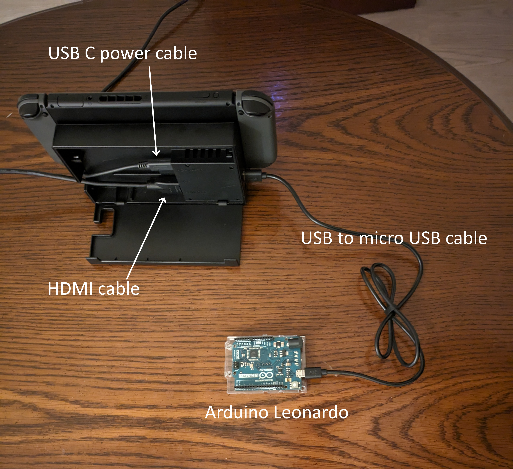

# **Part 2:** Microcontroller setup

| Automation Set-up Guide for Beginners |
| --- |
| [Introduction](/README.md)|
| **Part 1:** [Hardware needed](/Setup/HardwareNeeded/HardwareBeginner.md)|
| **Part 2:** [Microcontroller](/Setup/Microcontroller/Beginner-Windows-ArduinoLeonardo.md)(this page)|
| **Part 3:** [Computer control](/Setup/ComputerControl/Beginner-Windows.md)|
|Video - Guide to Pokemon Automation set-up: https://youtu.be/DFXZzWkOEMs|

---

Below you will find information on how to setup and use the hardware you bought in [**Part 1**](/Setup/HardwareNeeded/HardwareBeginner.md). On this page, we will learn how to load programs onto the microcontroller; this will be important whether you choose to use the Microcontroller or Computer Control programs.

> As a reminder: the Switch Lite does not output video feedback. It will not work for programs requiring video feedback.

For macOS and Linux users, use this [tutorial](Mac.md). The following steps in this page are for Windows user only.

## Step 1:  Install WinAVR

Download and install [WinAVR](https://sourceforge.net/projects/winavr/files/).

> It is strongly recommended to install it in the default directory (`C:/WinAVR-20100110`).

## Step 2: Download QMK Toolbox

Several QMK versions are known to work: 0.1.1, 0.2.2, 0.3.2. Other versions may not work.

Download [QMK Toolbox](https://github.com/qmk/qmk_toolbox/releases).

You want the file `qmk_toolbox.exe`. You'll find it under `Assets`, under the version number that you choose (e.g. 0.1.1).

## Step 3: Download the Arduino Programs

1. Download the latest version of our Arduino programs from [here](https://github.com/PokemonAutomation/Microcontroller/releases).

   * (The link should look like something like `PA-NativePrograms-0.x.x-xxxxxxxx.zip`)

   * If you get a virus or malware warning, ignore it. These are known false positives. If you don't trust us, the [source code is here](https://github.com/PokemonAutomation/Arduino-Source/tree/main/HexGenerator).

2. Once you have downloaded the package, unzip to somewhere you can access later. Do not put it on Microsoft OneDrive.

## Step 4: Generate a .hex file.

1. Open the (unzipped) package from previous step and double-click on `HexGenerator-Windows.cmd` to run it.
2. In the "Board Type" drop-down, change it to "Arduino Leonardo".
3. In the program list, click on "Turbo A".
> We recommend starting with "Turbo A"  as it is the simplest program. If you are able to get this running, it is easier to troubleshoot the other programs.

4. Click on "Save and generate .hex file!".

After a while, you should get a confirmation box saying it was successful. You should now see a file `TurboA-ArduinoLeonardo.hex` in the folder of the programs.

## Step 5: Flash the .hex into the Leonardo.

1. Run `qmk_toolbox.exe`, which we downloaded earlier in step 2.
   - Allow the drivers to install. 
   - If you don't get a prompt to install drivers. Click `Tools` in the toolbar, then `Install drivers`.
2. Within QMK toolbox, open the .hex you generated in the previous step.
3. Change the MCU to `atmega32u4`.
4. Check the "Auto-Flash" box.

5. Plug the Leonardo into your computer.

6. Press the reset button.

The QMK program will now flash the program to the Leonardo and show a bunch of logging.
Afterwards, the 3 LEDs on the Leonardo should flash in unison for 5 seconds before turning off.

7. Unplug the Leonardo from your computer.

## Step 6: Setup and run the program!

1. On your Switch, enter the game and navigate to somewhere you want to mash A in front of (such as the digging duo).

2. Navigate to the grip menu without closing the game. This disconnects all controllers from the Switch so that the Leonardo can take over.

3. Plug the Leonardo into your Switch's dock.

The program should now begin running. It will flash its lights for a few seconds, then it will connect to the Switch and navigate its way back into the game. After a brief pause, it will start mashing A.

**Usage Notes:**

- To stop the program, simply unplug the Leonardo at any time.
- Do not change video output or mess with the HDMI. These can cause the program to Switch to freeze for multiple seconds and break the program. If you want turn off the TV, do it *before* you start the program.

## Using Other Programs

You now know how to run TurboA - the most basic of the programs. You can choose any of the other programs and repeat steps 5-7.

- [Program List](/Wiki/Programs/README.md)

It is important to read the manual for a program before you use it. Each program has a different set of instructions and startup conditions.
You can find the manual for a program by clicking on the "Online Documentation" link.

## If you are only doing Microcontroller Automation, your tutorial ends here!

Congrats! You've learned how to automate!

## If you are doing Computer Controlled Automation, your next step is [here](https://github.com/PokemonAutomation/ComputerControl/blob/master/Wiki/Software/Beginner-Windows.md)

The next step will teach you how to put together and use the Computer Controlled hardware.

**Discord Server:** 

