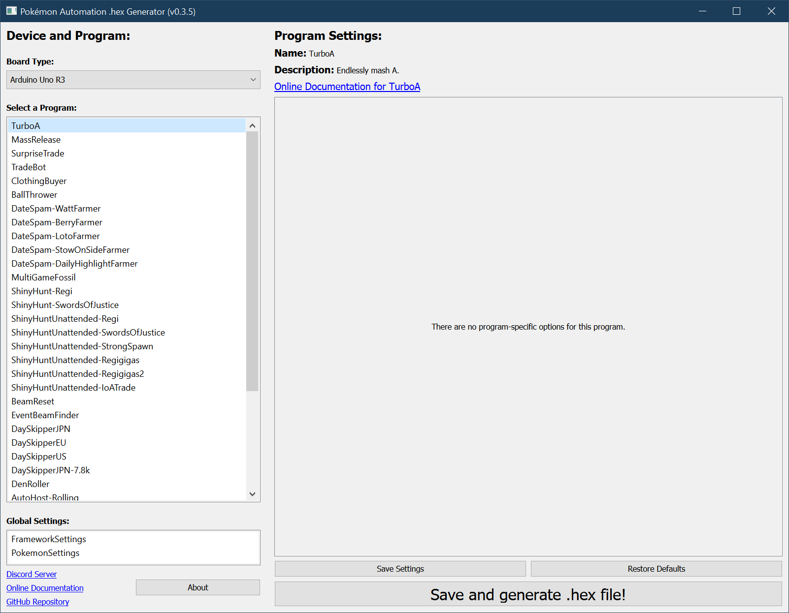
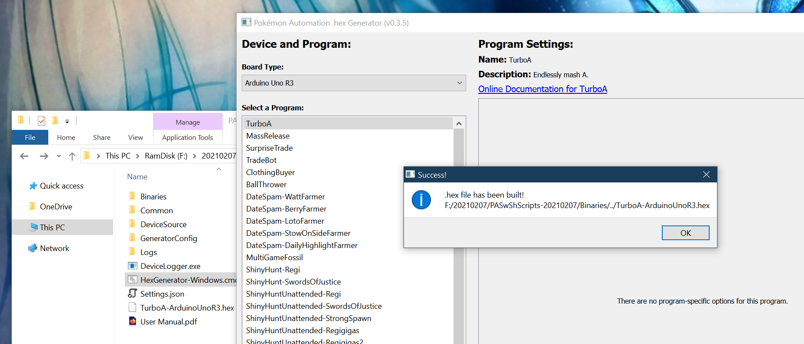
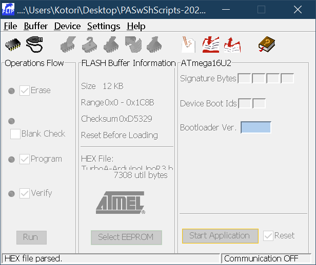
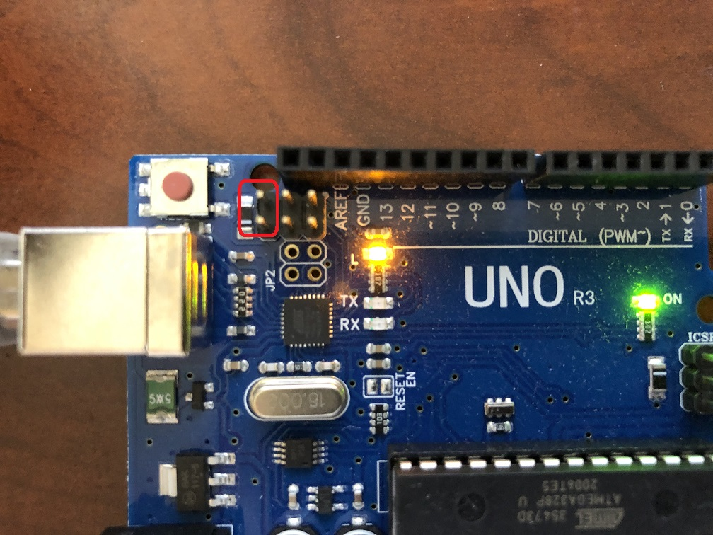
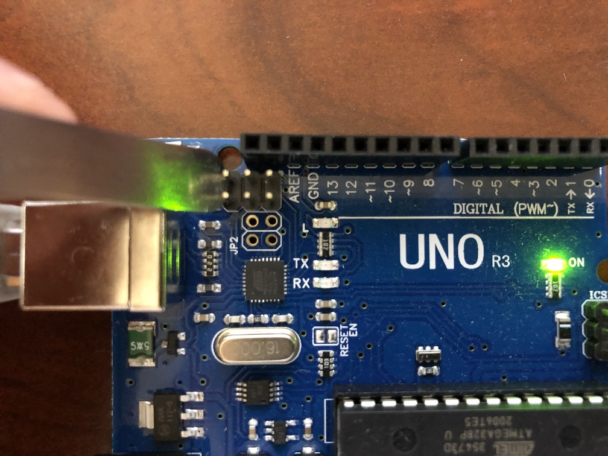
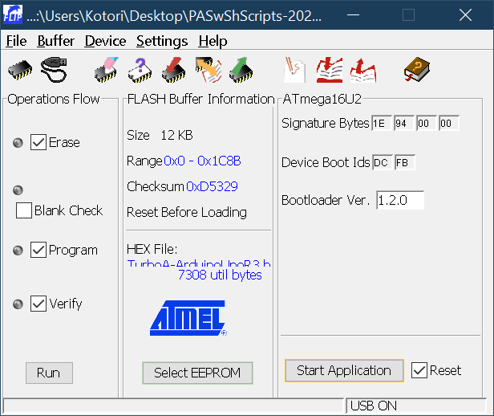
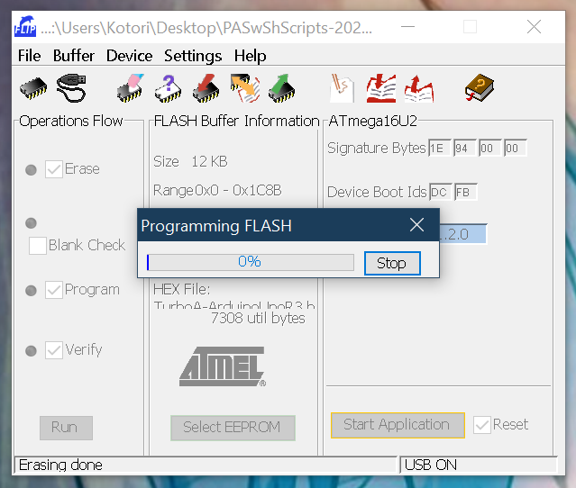

# Windows Tutorial - Arduino Uno R3

This section will walk you through the entire process of setting up your Arduino on a Windows computer.

***Warning: We strongly recommend against the Arduino Uno R3.***

1. The Uno R3 does not have sufficient memory or flash memory to run many of the serial programs. Those programs will not be able to run on this board.
2. Many of the Uno R3 boards cannot enter DFU mode to flash the the ATmega16u2 chip. These boards cannot be used at all. It is difficult to tell if the one you buy has this problem. And if it does, you're stuck and will need to get a different board.
3. Getting the correct drivers to install is hit-and-miss for different people.

## Step 1: Acquire the Hardware

Make sure you have the hardware:

- [Hardware - ArduinoUnoR3](../Hardware/ArduinoUnoR3.md)

## Step 2: Install WinAVR

Download and install [WinAVR](https://sourceforge.net/projects/winavr/files/).

It is strongly recommended to install it in the default directory (`C:/WinAVR-20100110`).

## Step 3: Download and install FLIP

Download and install [FLIP](https://www.microchip.com/developmenttools/ProductDetails/flip).

## Step 4: Download the Arduino Programs

Download the latest version of our Arduino programs from [here](https://github.com/PokemonAutomation/Microcontroller/releases).

(The link should look like something like `PA-NativePrograms-0.x.x-xxxxxxxx.zip`)

If you get a virus or malware warning, ignore it. These are known false positives. If you don't trust us, the [source code is here](https://github.com/PokemonAutomation/Arduino-Source/tree/main/HexGenerator).

Once you have downloaded the package, unzip to somewhere you can access later. Do not put it on Microsoft OneDrive.

## Step 5: Generate a .hex file.

1. Open the package from previous section and double-click on `HexGenerator-Windows.cmd` to run it.
2. In the "Board Type" drop-down, change it to "Arduino Uno R3".
3. In the program list, click on "Turbo A".

4. Click on "Save and generate .hex file!".

After a while, you should get a confirmation box saying it was successful. You should now see a file `TurboA-ArduinoUnoR3.hex` in the folder of the programs.

## Step 6: Flash the .hex into the Arduino.

1. Run the FLIP program that you downloaded earlier.
2. `Device` -> `Select`. Select `ATmega16U2` and click OK.
3. `File` -> `Load HEX File...`. Open the .hex you generated in the previous step.

4. Plug the Arduino into your computer.
5. Short the following two pins with a conductive object, then release it. Your computer should play the unplug/plug sound.

 

6. Click on the USB icon. Select `USB` and click `Open`.

If everything worked correctly, it should look like this:

If you get an error, then it usually means one of the following:
1. The ATmega16u2 driver hasn't been correctly installed.
2. Your Arduino cannot enter DFU mode.
3. Your computer allowing the Arduino to enter DFU mode.

If it is #2, then your board is defective and cannot be used to run programs in this package.
If it is #3, we still do not know the cause. There are reports that an Arduino works on one computer, but not another.

Many people get stuck at this point if an error occurs.

Debugging this can be tricky as you will need to open up Device Manager to see if the computer recognizes the device. Then you will need to mess with the drivers.
We won't go into too much detail on how to debug things at this point. This is one of the major reasons why we are moving away from the Arduino Uno R3.

7. Click Run.

If you see no errors, the you have successfully flashed the program to your Arduino!

8. Unplug the Arduino from your computer.

## Step 7: Setup and run the program!

1. On your Switch, enter the game and navigate to somewhere you want to mash A in front of (such as the digging duo).

2. Navigate to the grip menu without closing the game. This disconnects all controllers from the Switch so that the Arduino can take over.

3. Plug the Arduino into your Switch (or the dock that's attached to it).

The program should now begin running. It will flash its light for a few seconds, then it will connect to the Switch and navigate its way back into the game. After a brief pause, it will start mashing A.

**Usage Notes:**

- To stop the program, simply unplug the Arduino at any time.
- Do not change video output or mess with the HDMI. These can cause the program to Switch to freeze for multiple seconds and break the program. If you want turn off the TV, do it *before* you start the program.

## Other Programs

You now know how to run TurboA - the most basic of the programs. You can choose any of the other programs and repeat steps 5-7.

- [Program List](/Wiki/Programs/README.md)

It is important to read the manual for a program before you use it. Each program has a different set of instructions and startup conditions.
You can find the manual for a program by clicking on the "Online Documentation" link.

## Computer-Controlled Programs

Now that you are done with the Microncontroller tutorial, you can proceed to the [Computer-Control tutorial](https://github.com/PokemonAutomation/ComputerControl/tree/master/Wiki/Hardware/README.md).

**Discord Server:** 

