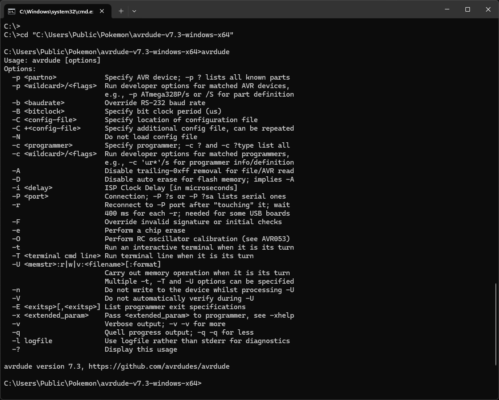
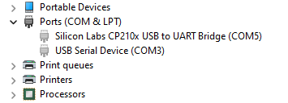
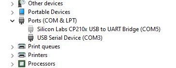

# **Part 2:** Microcontroller setup

| Automation Set-up Guide for Beginners |
| --- |
| [Introduction](/README.md)|
| **Part 1:** [Hardware needed](/Setup/HardwareNeeded/HardwareBeginner.md)|
| **Part 2:** [Microcontroller](/Setup/Microcontroller/Microcontroller-Beginner.md) (this page)|
| **Part 3:** [Computer control](/Setup/ComputerControl/ComputerControl-Beginner.md)|
|Video - Guide to Pokemon Automation set-up: https://youtu.be/DFXZzWkOEMs|

---

Below you will find information on how to setup and use the hardware you bought in [**Part 1**](/Setup/HardwareNeeded/HardwareBeginner.md). On this page, we will learn how to load programs onto the microcontroller; this will be important whether you choose to use the Microcontroller or Computer Control programs.

> As a reminder: the Switch Lite does not output video feedback. It will not work for programs requiring video feedback.

For macOS and Linux users, use this [tutorial](Microcontroller-Mac.md). The following steps in this page are for Windows user only.

## Step 1:  Install WinAVR

Download and install [WinAVR](https://sourceforge.net/projects/winavr/files/).

> It is strongly recommended to install it in the default directory (`C:/WinAVR-20100110`).

## Step 2: Download QMK Toolbox

A few QMK versions are known to work. e.g. 0.1.1, 0.2.2, and 0.3.1. Other versions may not work (e.g. 0.3.2 does not work).

Download [QMK Toolbox](https://github.com/qmk/qmk_toolbox/releases). Ensure you download a version known to work. e.g. 0.3.1.

You want the file `qmk_toolbox.exe`. You'll find it under `Assets`, under the version number that you choose (e.g. 0.3.1).

## Step 3: Download the Arduino Programs

1. Download the latest version of our Arduino programs from [here](https://github.com/PokemonAutomation/Microcontroller/releases).

   * (The link should look like something like `PA-NativePrograms-0.x.x-xxxxxxxx.zip`)

   * If you get a virus or malware warning, ignore it. These are known false positives. If you don't trust us, the [source code is here](https://github.com/PokemonAutomation/Arduino-Source/tree/main/HexGenerator).

2. Once you have downloaded the package, unzip to somewhere you can access later. Do not put it on Microsoft OneDrive.

## Step 4: Generate a .hex file.

1. Open the (unzipped) package from previous step and double-click on `HexGenerator-Windows.cmd` to run it.
2. In the "Board Type" drop-down, change it to "Arduino Leonardo".
3. In the program list, click on "Turbo A".
> We recommend starting with "Turbo A"  as it is the simplest program. If you are able to get this running, it is easier to troubleshoot the other programs.


4. Click on "Save and generate .hex file!".

After a while, you should get a confirmation box saying it was successful. You should now see a file `TurboA-ArduinoLeonardo.hex` in the folder of the programs.


## Step 5: Flash the .hex into the Leonardo.

1. Run `qmk_toolbox.exe`, which we downloaded earlier in step 2.
   - Allow the drivers to install. 
   - If you don't get a prompt to install drivers. Click `Tools` in the toolbar, then `Install drivers`.
2. Within QMK toolbox, open the .hex you generated in the previous step.
3. Change the MCU to `atmega32u4`.
4. Check the "Auto-Flash" box.


5. Plug the Leonardo into your computer.


6. Press the reset button.


The QMK program will now flash the program to the Leonardo and show a bunch of logging.
Afterwards, the 3 LEDs on the Leonardo should flash in unison for 5 seconds before turning off.


7. Unplug the Leonardo from your computer.

### Common errors with QMK toolbox
| Error | Solution |
| --- | --- |
| .NET error | First, ensure the drivers are installed (Tools -> Install Drivers). If this fails, try using a different version of QMK toolbox. See below for versions known to work. |
| "Flash complete", but no logging is shown | Unplug and replug the microcontroller into the computer and try flashing again. Try different USB ports. Try a different version of QMK toolbox. See below for versions known to work. |
| "COM port not found!" | Same as the issue where you get "Flash complete", but no logging, try unplugging and replugging the microcontroller into the computer and try different USB ports. Also, double check that the USB cable supports data transfer |

**Versions of QMK toolbox known to work:**
- 0.1.1
- 0.2.2
- 0.3.1

If all else fails, you can try flashing the hex file directly with avrdude. See [here](./Microcontroller-Beginner.md#flashing-the-hex-directly-with-avrdude) for instructions.

## Step 6: Setup and run the program!

To test that TurboA works:

1. On your Switch, enter the game and navigate to somewhere you want to mash A in front of (such as the digging duo). Alternatively, you can stand in front of the Pokemon center to repeatedly heal.


2. Navigate to the grip menu without closing the game. This disconnects all controllers from the Switch so that the Leonardo can take over.


3. Plug the Leonardo into your Switch's dock.


The program should now begin running. It will flash its lights for a few seconds, then it will connect to the Switch and navigate its way back into the game. After a brief pause, it will start mashing A.

**Usage Notes:**

- To stop the program, simply unplug the Leonardo at any time.
- Do not change video output or mess with the HDMI. These can cause the program to Switch to freeze for multiple seconds and break the program. If you want turn off the TV, do it *before* you start the program.

## Using Other Programs

You now know how to run TurboA - the most basic of the programs. You can choose any of the other programs and repeat steps 5-7.

- [Program List](https://github.com/PokemonAutomation/Microcontroller/blob/master/Wiki/Programs/README.md)

It is important to read the manual for a program before you use it. Each program has a different set of instructions and startup conditions.
You can find the manual for a program by clicking on the "Online Documentation" link.


## If you are only doing Microcontroller Automation, your tutorial ends here!

Congrats! You've learned how to automate!

<hr>

## If you are doing Computer Controlled Automation, your next step is [here](/Setup/ComputerControl/ComputerControl-Beginner.md)

The next step will teach you how to put together and use the Computer Controlled hardware.

<hr>

## Flashing the .hex directly with avrdude

1. Download avrdude
    - Download `avrdude-v7.3-windows-x64.zip` from [here](https://github.com/avrdudes/avrdude/releases). (other versions of avrdude may also work)
    - Unzip the folder
2. Open command prompt and change directory to the folder that contains `avrdude.exe`
   - To open command prompt: Press Windows key + R. Type `cmd` in the Run command box. Press `Enter`.
   - To change directory, type into the console:

   `cd "<path to the folder that contains avrdude.exe>"`

   - For example:

   `cd "C:\Users\Public\Pokemon\avrdude-v7.3-windows-x64"`

   - To confirm that this was done properly, type `avrdude` into the console. You should see the avrdude version number, as well as a list of options available.

   

3. Confirm your microcontroller's COM port.
    - Open Device Manager: Right click Start button -> Click "Device Manager"
    - Ensure hidden devices are shown: Click "View" in the toolbar -> "Show hidden devices"
    - Ensure the Leonardo is plugged into your computer and click the Leonardo's reset button. It should then show up in the Device Manager under `Ports (COM & LPT)`, as `USB Serial Device (COM#)`. Often, the Leonardo will then disconnect itself after a few seconds, and it will be greyed out in the list. However, if "Show hidden devices" is enabled, you should still be able to see the device and its COM port number.
    - In this example, the COM port for my Leonardo is COM3.

    

4. Flash the hex file with avrdude
   - Ensure the Leonardo is plugged into your computer and click the Leonardo's reset button. For a few seconds, it will no longer be greyed out in the Device manager. This means it's connected to your computer.

    

   - While the Leonardo is connected for those few seconds, type/paste the following command into the console:

    `avrdude.exe -p atmega32u4 -c avr109 -U flash:w:"<path to hex file>":i -P COM<number for COM port>`

   - For example:

   `avrdude.exe -p atmega32u4 -c avr109 -U flash:w:"C:\Users\Public\Pokemon\NintendoSwitch-TurboA-ArduinoLeonardo.hex":i -P COM3`

   - Note: The Leonardo only stays connected for a few seconds, so I recommend typing the command ahead of time in something like Notepad, then pasting the command into the console when you're ready.


If flashed successfully, it should look something like this:

```
C:\Users\Public\Pokemon\avrdude-v7.3-windows-x64>avrdude.exe -p atmega32u4 -c avr109 -U flash:w:"C:\Users\Public\Pokemon\NintendoSwitch-TurboA-ArduinoLeonardo.hex":i -P COM3

Connecting to programmer: .
Found programmer: Id = "CATERIN"; type = S
    Software Version = 1.0; No Hardware Version given.
Programmer supports auto addr increment.
Programmer supports buffered memory access with buffersize=128 bytes.

Programmer supports the following devices:
    Device code: 0x44

avrdude.exe: AVR device initialized and ready to accept instructions

Reading | ################################################## | 100% 0.00s

avrdude.exe: Device signature = 0x1e9587
avrdude.exe: NOTE: FLASH memory has been specified, an erase cycle will be performed
             To disable this feature, specify the -D option.
avrdude.exe: erasing chip
avrdude.exe: reading input file "C:\Users\Public\Pokemon\NintendoSwitch-TurboA-ArduinoLeonardo.hex"
avrdude.exe: writing flash (7858 bytes):

Writing | ################################################## | 100% 0.75s

avrdude.exe: 7858 bytes of flash written
avrdude.exe: verifying flash memory against C:\Users\Public\Pokemon\NintendoSwitch-TurboA-ArduinoLeonardo.hex:
avrdude.exe: load data flash data from input file C:\Users\Public\Pokemon\NintendoSwitch-TurboA-ArduinoLeonardo.hex:
avrdude.exe: input file C:\Users\Public\Pokemon\NintendoSwitch-TurboA-ArduinoLeonardo.hex contains 7858 bytes
avrdude.exe: reading on-chip flash data:

Reading | ################################################## | 100% 0.19s

avrdude.exe: verifying ...
avrdude.exe: 7858 bytes of flash verified

avrdude.exe: safemode: Fuses OK

avrdude.exe done.  Thank you.
```

### Troubleshooting

| Error | Solution |
| --- | --- |
| ArduinoLeonardo.hex is not readable: No such file or directory | Double check that you typed your file path to the .hex file correctly. Ensure there aren't any extra spaces that shouldn't be there. |
| cannot open port \\\\.\COM#: The system cannot find the file specified. | Make sure you typed in the correct COM port number. Also, make sure the Leonardo is plugged in and detectable by the Device Manager. If not, click the Leonardo's reset button |


<hr>

**Discord Server:** 

[](https://discord.gg/cQ4gWxN)


