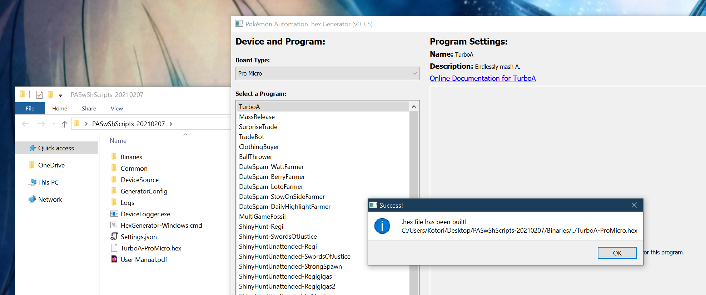
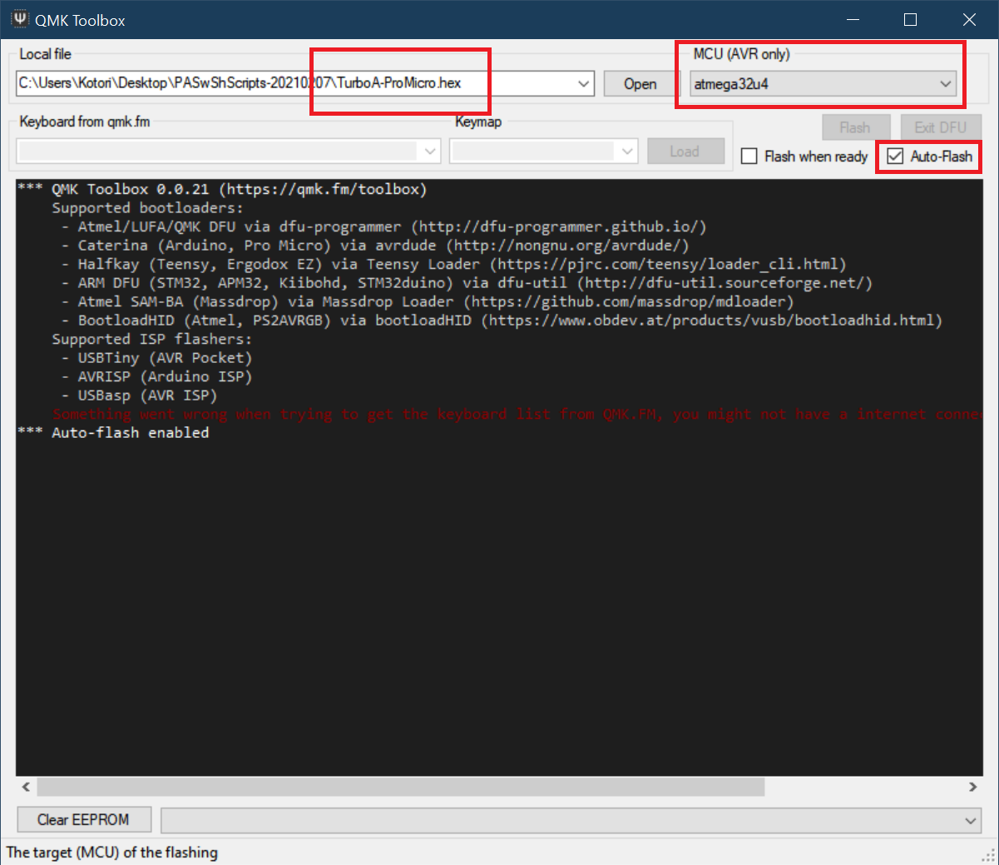
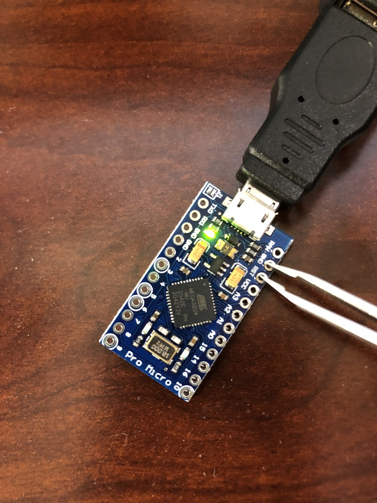
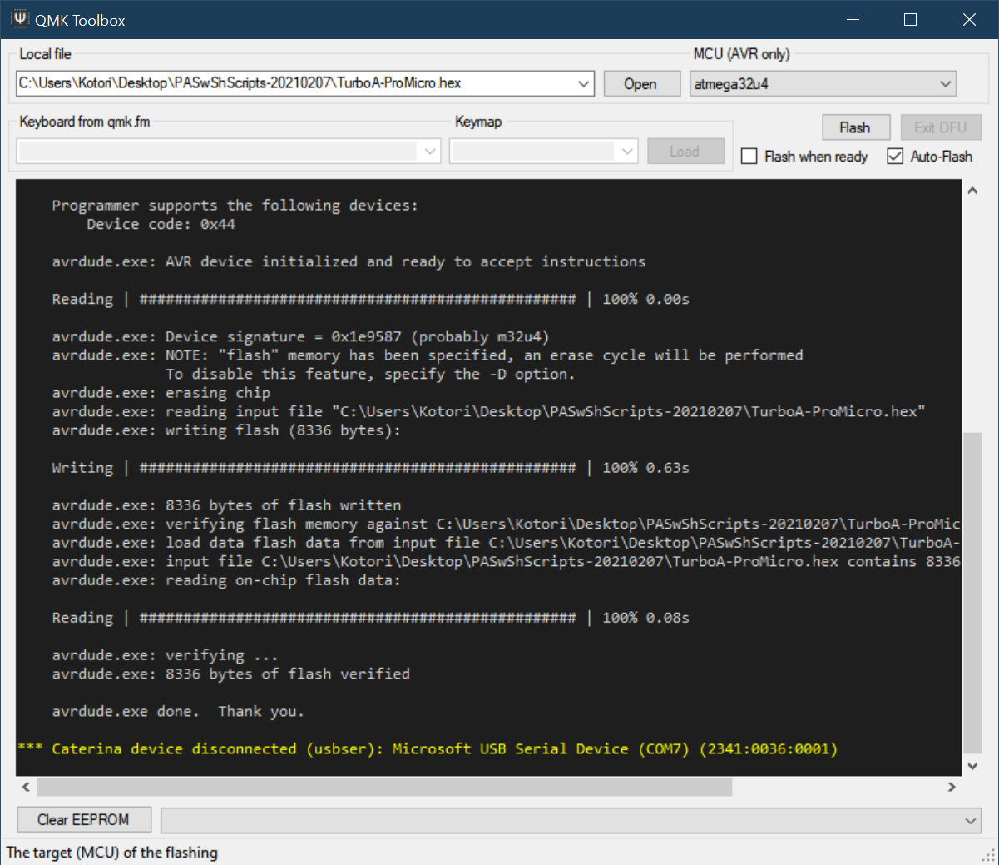
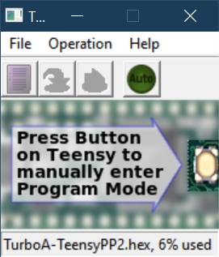
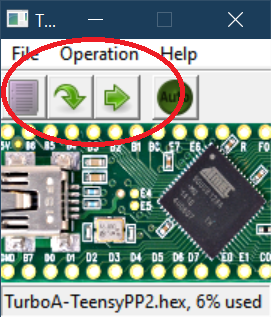
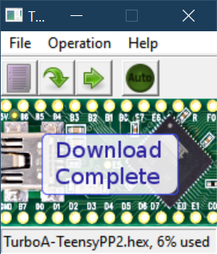

# **Part 2:** Microcontroller setup - experienced users

If you're reading this page, we assume you are a user that is experienced with microcontrollers.

**First, read the [beginner guide to microcontroller setup](./Microcontroller-Beginner.md) to understand how to flash programs onto the microcontroller.** This page only provides supplementary information to the beginner guide.

## Step 0: Acquire the Hardware

Make sure you have the hardware from [Part 1](/Setup/HardwareNeeded/HardwareExperienced.md)

## Step 1: Install WinAVR

- Download and install [WinAVR](https://sourceforge.net/projects/winavr/files/).
- refer to the [Beginner guide](./Microcontroller-Beginner.md) for more details

## Step 2: Download the program to flash the microcontroller

### If you have the Arduino Leonardo or Pro Micro

- Download [QMK Toolbox](https://github.com/qmk/qmk_toolbox/releases).
- refer to the [Beginner guide](./Microcontroller-Beginner.md) for more details

### If you have the Teensy 2.0 or Teensy++ 2.0 

- Download [Teensy Loader](https://www.pjrc.com/teensy/loader.html).

- Direct download link: https://www.pjrc.com/teensy/teensy.exe

## Step 3: Download the Arduino Programs

Download the latest version of our Arduino programs from [here](https://github.com/PokemonAutomation/Microcontroller/releases).
- refer to the [Beginner guide](./Microcontroller-Beginner.md) for more details

## Step 4: Generate a .hex file.

- refer to the [Beginner guide](./Microcontroller-Beginner.md) for more details
- Run `HexGenerator-Windows.cmd` from the unzipped Arduino programs folder. Set the program to "Turbo A".
- However, in the "Board Type" drop-down, change it the type of board you have (e.g. "Pro Micro" or "Teensy 2.0/++2.0").
- Click on "Save and generate .hex file!".
- If successful, You should now see a file `TurboA-<Board-Type>.hex` in the folder of the programs (e.g. `TurboA-ProMicro.hex`).

## Step 5: Flash the .hex onto the microcontroller.

### If you have the Arduino Leonardo

- refer to the [Beginner guide](./Microcontroller-Beginner.md)

### If you have the Pro Micro

1. Run the QMK Toolbox program that you downloaded earlier.
2. Open the .hex you generated in the previous step.
3. Change the MCU to `atmega32u4`.
4. Check the "Auto-Flash" box.

5. Plug the Pro Micro into your computer.
6. Short the GND and RST holes. (use tweezers)

The QMK program will now flash the program to the Pro Micro and show a bunch of logging.

7. Unplug the Pro Micro from your computer.

### If you have the Teensy 2.0 or 2.0++

1. Run the Teensy Loader program that you downloaded earlier.
2. Click the purple file icon and browse for the .hex that was created in the previous step.

3. Plug the Teensy into your computer.
4. Press the white button on the Teensy. You may need to wait for Windows to install drivers.

At this point, two green arrows should show up in Teensy Loader.

5. Click the left arrow. This flashes the program into the Teensy.

6. Unplug the Teensy from your computer.

## Step 6: Setup and run the program!

- refer to the [Beginner guide](./Microcontroller-Beginner.md)

## Other Programs

You now know how to run TurboA - the most basic of the programs. You can choose any of the other programs and repeat steps 5-7.

- [Program List](https://github.com/PokemonAutomation/Microcontroller/blob/master/Wiki/Programs/README.md)

It is important to read the manual for a program before you use it. Each program has a different set of instructions and startup conditions.
You can find the manual for a program by clicking on the "Online Documentation" link.

## Computer-Controlled Programs

Now that you are done with the Microcontroller tutorial, you can proceed to the [Computer-Control tutorial](/Setup/ComputerControl/ComputerControl-Experienced.md).

**Discord Server:** 

